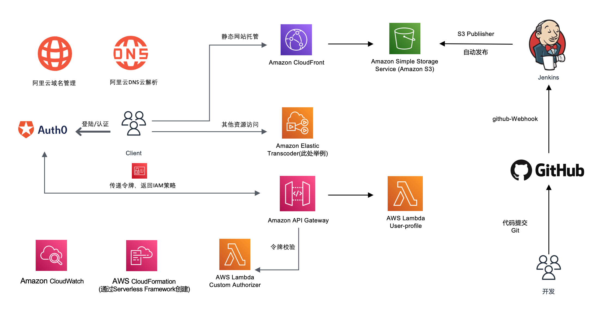
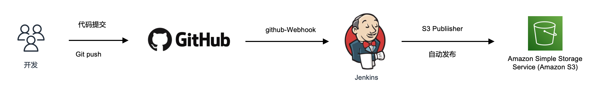

<p align="center">
  <a href="http://corhyam.xyz">
    
    <!--     -->
  </a>
</p>
<p align="center">
   <strong>基于Serverless Framework快速部署docsify上云</strong>
</p>


---

>该Wiki系统主要使用AWS各产品，Serverless Framework以及docsify进行搭建。

>知识库中概念性知识摘自网络上优秀文章以及各大百科。其余均为本人原创，非原创部分已标明相关出处。
>
>**由于本人造诣不深，仍在不断充实自己，文档仅用于记录一下该系统搭建过程中碰到的各种问题以及自己的学习过程，仅用于个人学习，如有错误之处或其他问题，还请予指正。**

<br>

**由于对云计算层面比较感兴趣，许多新兴技术应运而生。在接触到AWS Lambda与阿里云函数计算时，感觉Serverless技术较为有趣，故想尝试着搭建网站做做尝试。
初次接触Serverless架构，架构的想法如下。**



---

> - **本人的个人域名在阿里云中，所以使用阿里云DNS云解析解析至AWS S3静态网站托管地址。**
> - **AWS Lambda：用作无服务器后端，实现用户信息反馈以及自定义授权方功能。**
> - **AWS API Gateway：API网关，统一对外接口**
> - **Auth0：第三方认证提供商**
> - **使用Serverless Framework进行docsify快速部署，并引入Jenkins+Github实现静态文档的CI/CD。**
> - **AWS CloudWatch：云监控服务**
> - **AWS CloudFront：内容分发网络(CDN)**

---

<br>

# 快速部署

## 初始化docsify

**全局安装`docsify-cli`工具**

```bash
npm i docsify-cli -g
```

---

<br>

**项目初始化**

```bash
docsify init client/dist
```

**文件路径可以根据你自己的选择做修改，但建议使用`client/dist`，后续就不用去`serverless。yml`做配置**

---

<br>

**初始目录结构**

初始化成功之后，会自动在目录中创建文件。

- `index.html` 入口文件
- `README.md` 会做为主页内容渲染，在访问网页时主页中显示该md的内容。
- `.nojekyll` 用于阻止 GitHub Pages 忽略掉下划线开头的文件。 **本文使用AWS S3做部署，所以该文件可要可不要**

直接编辑 `docs/README.md` 就能更新文档内容。

---

<br>

### 本地预览

使用`docsify serve`启动本地服务器实现预览

```bash
docsify serve client/dist
```

---

<br>

## 安装Serverless Framework

> **本文主要展示为使用`Serverless Framework`部署`docsify`至`AWS`。**

<br>

> 其余云平台如何配置可以根据[Serverless官网](https://www.serverless.com/)中的文档进行修改。由于国内Serverless Framework与`腾讯云`之间有合作，并且时区不同，所以Serverless Framework安装之后默认是使用腾讯云的，**如果有腾讯云账号，腾讯云有一个解决方案是使用Serverless Component，使用component腾讯云是能够最快实现部署的，不需要做其他的配置，编写Serverless.yml即可立即部署。**

<br>  

> 由于在国内Serverless Framework文档较少，google也翻不到，在想要配置默认提供商为AWS，以及配置AWS凭证时便碰了几次壁。跑到stack overflow寻找，询问Serverless平台中的人才得以解决。

---

<br>

**安装Serverless Framework**

```bash
npm install -g serverless
```

**修改默认提供商(重要)**

> 不修改平台提供商则默认时`腾讯云`，某些命令反馈的情况也不相同。

<br>

 **修改环境变量**

```bash
vim ~/.bash_profile
```

**将下方环境变量配置添加到`.bash_profile`中**

```shell
export SERVERLESS_PLATFORM_VENDOR=aws
```

`:wq`保存之后输入下方命令使其生效

```shell
source ~/.bash_profile
```

查看版本

```bash
serverless -v
```

---

<br>

## 设置AWS凭证

### 配置凭证之前，需要先在AWS IAM（Identity & Access Management）中创建对应的用户，附加需要的策略后创建，并妥善保存您自己的密钥对。

官方的示例如下：

```bash
serverless config credentials --provider aws --key <your-key> --secret <your-secret-key>
```

又或者如我的做法，直接在` ~/.aws/credentials`中配置( 不存在则手动创建 )

```bash
vim ~/.aws/credentials
```

```
[default]
aws_access_key_id=<your-access-key>
aws_secret_access_key=<your-secret-key>
aws_session_token=FwoGZXIvYXdzEHQaDO3UKi03vjqW71YdlyLCARsCGafzixZWyZrZe/FmwC/SnHT0JlRr5UvLJGqltsP15zjT5wxNlN49TKabfhsBBp5GzseGH+G64r9+t**********
~                                                                               
~                                                                                                                                                                                                                                           
"~/.aws/credentials" [noeol] 4L, 498C
```

> **由于此处本人的AWS账号为AWS educate账号，提供的是临时凭证，需要有session_token。**

> **所以建议在IAM中创建AWS用户，附加需要的策略，创建用户后保存对应的AK/SK**

<br>

---

## 使用Serverless finch部署docsify

安装`Serverless finch`

```bash
npm install --save serverless-finch
```

> serverless-finch可以用作静态网站部署，运行`serverless client deploy`命令后会部署client/dist里面的内容至存储桶。

创建serverless.yml

```bash
touch serverless.yml
```

将以下内容填入到serverless.yml中

```yaml
service: docsify-test

plugins:
  - serverless-finch
#网站部署plugins

custom:
  client:
    bucketName: serverless-aws-docsify

provider:
  name: aws
```

> **其中`service`为服务名，`bucketName`根据自己的需求进行修改**

最后，部署docsify

```bash
serverless client deploy
```

即可部署至aws s3存储桶中，返回的域名即为静态网站托管的域名。

<br>

---

---


## 实操

**配置好对应凭证之后，部署全过程命令以及部署全过程日志如下：**

```shell
corhyam@Ccc-MacBook-Pro aws-serverless-docsify % ls
corhyam@Ccc-MacBook-Pro aws-serverless-docsify % docsify init client/dist

Initialization succeeded! Please run docsify serve client/dist

corhyam@Ccc-MacBook-Pro aws-serverless-docsify % docsify serve client/dist

Serving /Users/corhyam/aws-serverless-docsify/client/dist now.
Listening at http://localhost:55627

^C
corhyam@Ccc-MacBook-Pro aws-serverless-docsify % npm install --save serverless-finch

up to date, audited 125 packages in 2s

found 0 vulnerabilities
corhyam@Ccc-MacBook-Pro aws-serverless-docsify % touch serverless.yml
corhyam@Ccc-MacBook-Pro aws-serverless-docsify % vim serverless.yml
corhyam@Ccc-MacBook-Pro aws-serverless-docsify % serverless client deploy
Serverless: This deployment will:
Serverless: - Upload all files from 'client/dist' to bucket 'serverless-aws-docsify'
Serverless: - Set (and overwrite) bucket 'serverless-aws-docsify' configuration
Serverless: - Set (and overwrite) bucket 'serverless-aws-docsify' bucket policy
Serverless: - Set (and overwrite) bucket 'serverless-aws-docsify' CORS policy
? Do you want to proceed? true
Serverless: Looking for bucket...
Serverless: Bucket found...
Serverless: Deleting all objects from bucket...
Serverless: Configuring bucket...
Serverless: Configuring policy for bucket...
Serverless: Retaining existing tags...
Serverless: Configuring CORS for bucket...
Serverless: Uploading client files to bucket...
Serverless: Success! Your site should be available at http://serverless-aws-docsify.s3-website-us-east-1.amazonaws.com/
corhyam@Ccc-MacBook-Pro aws-serverless-docsify % tree
.
├── client
│   └── dist
│       ├── README.md
│       └── index.html
└── serverless.yml

2 directories, 3 files

```

>http://serverless-aws-docsify.s3-website-us-east-1.amazonaws.com/ 即为docsify文档托管域名，最好是使用自己域名，根据自己的需求，把该CNAME加入到域名解析。

---

---


> 后续更新文档可以再次运行`serverless client deploy`以实现文档更新，但是若嫌麻烦，还可尝试使用`github actions`对静态文档进行推送。由于本人AWS账号为Educate账号有所限制，所以做法有所不同，但是该做法同样也适用于AWS基本账号。引用jenkins做自动构建。当你代码提交至github后，通过github-webhook，让Jenkins进行构建。

> :point_right:  ​[Jenkins实现简单ci/cd](client/dist/jenkins-cicd.md)



!> 如部署期间遇到问题欢迎留言讨论。

> **如有错误之处，还请予指正。**


