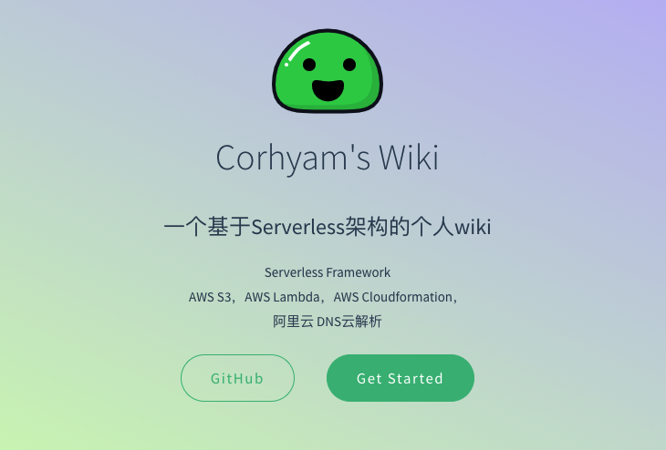
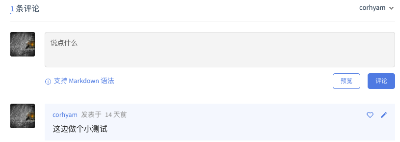

## 文档系统封面_coverpage



>封面个人文档内容简介，Github跳转按钮，以及文档Get Started按钮，点击后跳转至README.md

---


## 搜索栏_search.min.js


>页面左上角搜索栏，可根据需要搜索文档内容

---


## Edit on GitHub_跳转


> 点击Edit on Github跳转至当前页面文档的链接页面。

---


## Github Corner 


> 点击角标跳转至个人Github中

---

## 图片缩放以及代码复制到剪贴栏

```html
 <script src="//cdn.jsdelivr.net/npm/docsify-copy-code"></script><!--add Copy to Clipboard添加复制到剪贴板-->
 <script src="//cdn.jsdelivr.net/npm/docsify/lib/plugins/zoom-image.min.js"></script><!--点击图片放大缩小-->
```

>引入相关JS实现，**点击图片可进行图片放大。移动鼠标至上方代码块会出现复制到剪贴板按钮**📋

## Gitalk评论功能



>与Gitalk集成，实现评论功能，结合gIthub OAuth Apps以及github issue实现。发表的评论会保存在该项目的issue页面。
>
>https://github.com/corhyam/serverless-wiki/issues

