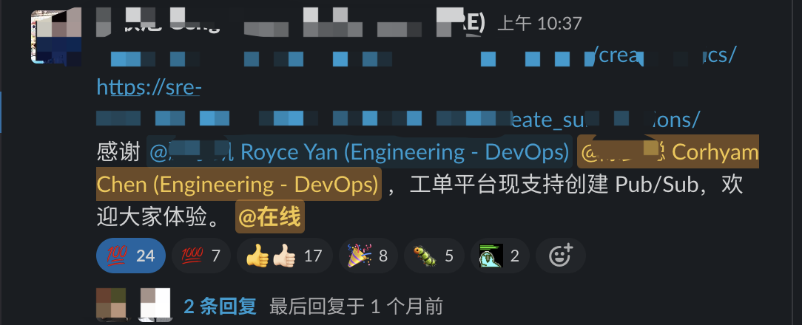
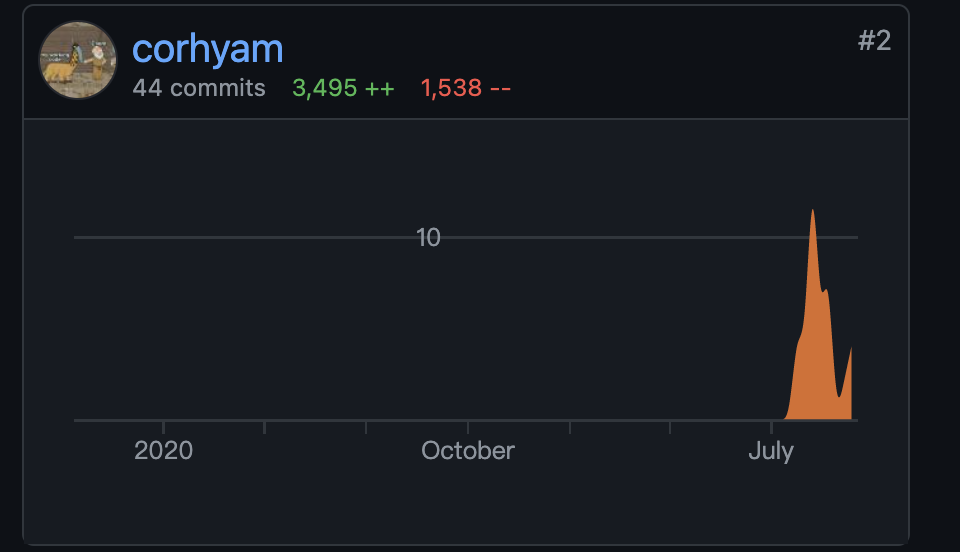
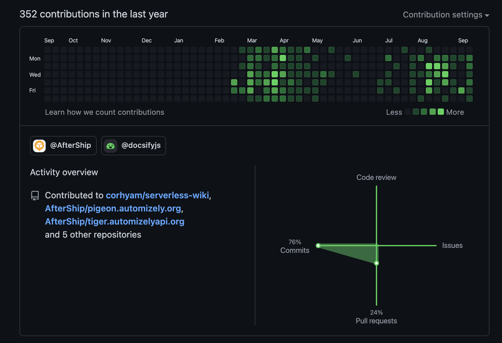
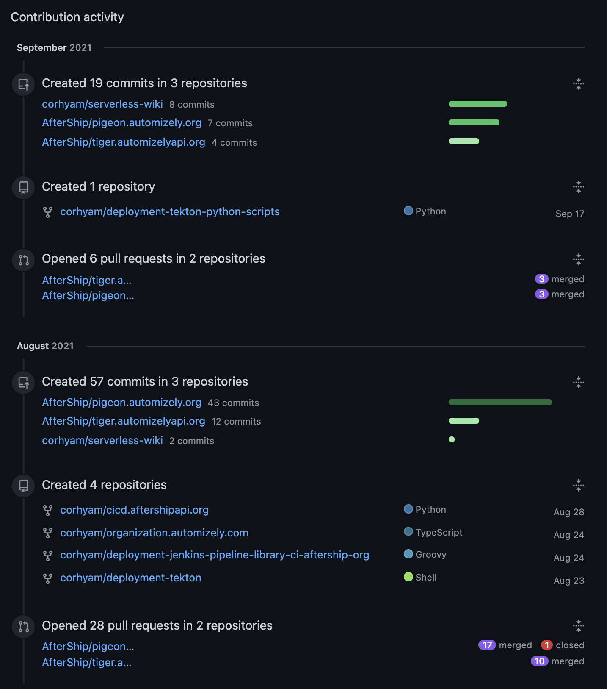

# 📦 AfterShip Study Progress

## **📅日期**

**2021-07-01**

## 今日工作总结

- 主要为安装软件，跟着`checklist`进行安装软件，1password，slack，gmail
- 公司规章制度等，new Relic，Vpn配置等，slack命名规范
-  Jira，github配置，AWS的MFA配置

---

## **📅日期**

**2021-07-02**

## 今日工作总结

- Github MFA配置，Jira CICD了解，zoom配置，Google calendar日历加入slack
- 规章制度文化，`On-boarding`反馈，automizely store
- GCP本地环境搭建

---

## **📅日期**

**2021-07-05**

## 今日工作总结

- `jq`   ✅
- `gcloud sdk`✅
- `helm (v2.16.7)`✅
- `kubectl`✅
- `docker，docker-compose`✅
- `awscli`✅ **对应的环境都登录进去改一下密码做好记录**
- [ nvm](https://github.com/nvm-sh/nvm#installing-and-updating) (安装 nodejs 10.15, 12.15, 8.15)✅
- `serverless framework` ([serverless.com](http://serverless.com))✅
- `vim` 工具安装✅
- `GCP`配置，公司账号配置github，✅
- **Fork github** [pigeon.aftership.org](http://pigeon.aftership.org) 尝试去了解一下前端代码 如果不懂`iview`尝试参考`elementUI`，思考一下前端vue的学习方向

!> **注意事项⚠️：**

**装环境尽快完成 可以的话记得更新过程 加到自己的个人Wiki上！！！！！！**  

**报销流程查看** 看看高铁票能不能报销哈哈🧐 在公司相关Notion查看就有

> `DevOps`常用工具链接： [**https://www.notion.so/automizely/13d5567b516e4c6291c9046a28c4085f**](https://www.notion.so/automizely/13d5567b516e4c6291c9046a28c4085f) 

> 公司目前`CICD`架构图：  [**https://www.notion.so/automizely/Architectural-Overview-92945960f5c64fb8bf0a0cee94836571#4a008de930584b99b3c2d7bd51698dee**](https://www.notion.so/automizely/Architectural-Overview-92945960f5c64fb8bf0a0cee94836571#4a008de930584b99b3c2d7bd51698dee)

**公司架构了解并且在了解过程中对文档进行补充。**  [**https://docs.google.com/presentation/d/1lVVm-EFVP8vTDbJUZmzjOvo5FnWOXcqaCWByDiHiBto/edit#slide=id.g7c9fd3acc3_0_0**](https://docs.google.com/presentation/d/1lVVm-EFVP8vTDbJUZmzjOvo5FnWOXcqaCWByDiHiBto/edit#slide=id.g7c9fd3acc3_0_0)

**`SRE training` Docs 并且还有一些培训视频可以看一下**  

[**https://www.github.com/aftership**](https://www.github.com/aftership) **有空去看看`github`上的公司开源代码  **

> **每两个星期的周二 会有一个`Devops sprint`会议 总结与制定总结两周内容 **
>
> **后续子和哥说`DBA`那边有需求 看问一下需要支持或者开发什么自动化的内容 可先看一下工单平台`Pigeon`的代码**

---

## **📅日期**

**2021-07-06**

## 今日工作总结

- `Pigeon `and `Tiger`配置，python3，vue-cli，
- `SRE helper`，`pigeon`环境搭建，tiger环境搭建，python虚拟环境virtualenv。

> 因为在开发过程经常需要碰到不同的环境 所以python虚拟环境virtualenv能起到一个重要的作用 创建出一个相对隔离的环境

---

## **📅日期**

**2021-07-07**

## 今日工作总结

- `Inode`过高导致Jenkins挂掉 这个问题没太懂 后续问一问凯哥看是什么情况（小文件过多 PR文件多）
-  `jenkins`多分支构建由于业务逻辑写在`pipeline`中，所以需要把相关的ci逻辑写到pipeline中执行，单分支则无需考虑。
- pigeon项目环境安装，tiger项目配置 （缺config.yaml或者development.yaml）

---

## **📅日期**

**2021-07-08**

## 今日工作总结

- `灰度调研方案会议`，架构了解。（主要是建柱哥负责 可以问问 并且有流量灰度与实例灰度 火哥是陈日燊）

- `tiger`以及`piegon`项目的环境配置，requiement相关依赖注入，virtualenv，redis配置，mysql本地环境等

- `django`项目架构了解，看一下相关Serialize序列化相关的代码，setting.py中内容细看

  ---

  

## **📅日期**

**2021-07-09**

## 今日工作总结

- `vue`前端项目知识学习，架构相关了解，pigeon的项目`api`跳转流程，`app.vue`入口文件，
  点击事件-触发函数-触发方法-api调用后端-返回数据
- `Django`项目学习，后端逻辑，`setting`配置，`urls`映射。`views-model`。

---

## **📅日期**

**2021-07-12**

## 今日工作总结

- `Django`与`vue`前后端交互逻辑，方法调用。
- 有空去看看群里灰度调研方案的情况，`Kong`还有`helm`，`ArgoCD`需做了解。
- `views`中的`@method_decorator`尝试自己和Java的设计模式做对比学习以及`mvc`与`mtv`。

---

## **📅日期**

**2021-07-13**

## 今日工作总结

- 灰度发布的会议，去`notion`内部查看一下相关的架构图情况。
- `django`与`vue`配置文件以及相关情况了解。
- 微服务网关目前用`Kong`以及`ingress`进行管理，相辅相成，kong弥补ingress中类似认证鉴权以及服务熔断降级，健康检查等功能。

>  **`Pub/sub` 消息队列创建的自动化实现 看看要怎么搞**

创建`ticket`->审批->创建`topics`

中间主要处理`pubsub`4个页面 优化`create`页面和`list`页面 添加`edit`功能 

---

## **📅日期**

**2021-07-14---2021-07-16**

## 三日工作总结

- 近三天主要以查看工单平台`Pigeon`相关代码为主
- `DBA`那边的需求好像是志丽姐那边自己做预计是前端使用`Vue elementUI`，后端用`Java`去做，后续可以去了解一下学习一下相关的东西
- 后面旭哥那边好像是有一个Pub/Sub自动化的一个需求，先去提前了解一下`PubSub`是什么（把它当做消息队列类似`kafka`）
- 这边子和哥好像要休假了，心里祝福一下👏！后续早会是玺哥进行组织
- **多听少说，多听部门人说话。”言寡尤，行寡悔”少说错话，少做后悔的行动“**

---

## **📅日期**

**2021-07-19---2021-07-23**

## 一周工作总结

- 跟旭哥沟通`Pub/Sub`自动化的相关需求，这边前端让我进行负责，虽然没碰过太多前端但是记得克服一下学一下`Vue`，补一下前段时间漏掉的开发知识。
- 总共是四个页面，`Topics`以及是`Subsciptions`的创建以及审批界面
- `Topics`的相关页面会简单一点，`Topic`的展示页面就直接读数据就行，调用对应的get请求去做信息获取后过滤。
- 继续多看一下相关代码 参考凯哥写的`Kong`以及`Github`模块的代码
- `On/off-boarding`块的代码是以前一个叫“超哥”的写的，代码逻辑看得比较头疼
- 打球的时候`Brandy`的川哥提到了一下，如果代码写得不是太规范，可以尝试自己重新写一遍页面，不一定要照着前面的做法，不然容易写得头疼。

**主要还是得继续负责`PubSub`相关的代码编写，下周开始逐渐参与到代码开发中去。**

!> **凯哥生文哥他们也会比较忙，所以有问题的话稍微攒一下，等到下午准备吃饭的时候把问题集中问一问，常规时间能不打扰尽量先不打扰。**

---

## **📅日期**

**2021-07-26---2021-07-30**

## 一周工作总结

- 这周有个灰度发布相关的会议，这部分是建柱哥负责，前端react后端用node.js，是Lafite那边负责，Tekton部分代码是我们部门进行开发，后续多去了解一下。里面可能`helm`，`Kong`，`Tekton`以及`Argo CD`需要多去看看。

- 周三的中午和`Lemonade` 的Victor进行了约饭，感觉聊起来不错，亲和力很好，公司里的核心成员，之前API的课程讲得很生动，可以复盘学习一下。

- 🚩**7月28日** 和子和哥约了第一次1v1会议，制定考核表中的内容，以及聊一下是否有什么需要他去帮忙协调的。以及说后续的自己的规划与学习方向。（后续多看`K8s`，积极沟通）

- 🚩`SRE` 周会的时候当了次主持人，主要是过一下`okr`表(类似KPI的东西)以及是团队状态进度，大家都点沉默，稍微有点尬住了。

  > **自己在某些场合的心理状态还是没能太调好，过分在意他人的眼光导致紧张，常规开会的时候并没有太紧张或其他情况）**
  
> **很喜欢现在部门相对扁平化的一个氛围，刚进公司礼貌是必需要有的，但自己在现在部门中可以不需要过分礼貌，否则会有隔阂。以前接触的过分强调层级化会让自己内心经常有顾虑，作为初入职场会很紧张很不舒服）**

---

## **📅日期**

**2021-08-02---2021-08-06**

## 一周工作总结

- 这周主要还是工单平台相关代码开发，`Pigeon`为首要，目前大致`Topics`页面快编写完成，`Subscriptions`相关页面由于要求比较高而且比较繁杂，所以后续需要和旭哥那边进行相关沟通，再做开发
- `Google`里的Retain message durations信息保留时长是一个比较奇葩的字段，它是一个带s（秒）的字符串。
  如`“604800s”`一类的数据，所以需要进行沟通。
- 吐槽一下`iview`是真的难用，排查问题的时候都要去看源码才能知道解决方法。就像`Select`框的`filterable`出问题了，是由于相关的检索方式不同，检测了value之后还会检测lable，所以逻辑会有不同导致无法提供搜索功能。
- 周二时候和Ruby约了一个`free talk`的会议，讨论了一下最近校招培训的相关课程以及是对应的想要反馈的点，投心仪讲师的时候投了子和哥，Victor以及小军哥。并且提了一下技术夜谈中想问的问题，如职业生涯的规划与转折点，如何提高工程师意识以及软实力。

> **这段时间总体大致还是以`Pub/Sub`自动化开发为主，前端这方面由于这个项目慢慢对vue进行了熟悉，最初没碰过前端让我忽然写前端心里确实没有什么底，内心除了焦虑没别的想法，慢慢调节了下心态，开发也逐渐流畅了起来，碰到问题也能自己从各大搜索引擎与论坛找到解决方案，真的卡了很久的问题就去问下凯哥旭哥他们。**

> **最近自己加了一下班处理问题，也向生文老哥打听到了一下关于前端编写时的一些规范，后面编写的时候多注意一下`request`请求的一些规范。**
>
> **（到时候看看加班是不是有个补贴来着哈哈哈哈哈，周末翻一下`Notion`。要打车尽量9点整点叫，否则后面和`shopee`的一起下班基本不存在能坐车，9点是标准时间，叫到可以走。9：00-10：30均为高峰期，最高都能排100多真的很离谱，而且不要相信滴滴和高德给你推测的时间，上了几次大当！！）**

---

## **📅日期**

**2021-08-09---2021-08-13**

## 一周工作总结

- 还是负责`Pub/Sub`相关的开发，这周开始合PR到测试环境公司`release`，`testing`开头的都是测试环境，但是我目前最好就只拿release环境去做测试比较安全。合并的时候尽量从release/incy平台合并到master，**千万不要直接合，除非特殊情况**
- 在早会同步了几次`PubSub`这个感觉有点不太好了，好像自己一直就只做这一个东西一样.......后续多把自己学的东西也稍微说一说，虽然说都是比较基础的东西...
- **8月13日** ` Pub/Sub`自动化上到`Production`环境，并且输出了相关文档来进行指引，成就感是有一点的，毕竟是自己头一次写出来的项目，虽然不是一个真的很大的功能，但也算是一小步吧

!>  本周和`leader1v1`会议中谈到了一个**主人公意识**，`Pub/Sub`可以去尝试持续去做进行优化，逐渐提升一下用户体验，对不同的需求进行整理与开发。

下周逐渐开始优化`Pub/Sub`的东西，后续好像有`On/off boarding`需要我去做一些优化，有空可以多去看一下`CICD`相关的代码，毕竟这一大块也是重中之重，以后处理问题应该大部分都和CICD这一块有关联。

**这周末七夕来着 自己看吃顿好的  看给爸妈订个地方吃饭让他俩庆祝一下。**✅

---

## **📅日期**

**2021-08-16---2021-08-20**

## 一周工作总结

- 这周熟悉了一下`On/Off boarding`内的相关代码，看到了一大串相对冗长的代码感觉怪怪的，而且写法也已经完全不同，`if else`的判断过多，看着脑壳有点小疼，后面看优化一下对应的input框来做规范

- `Pub/Sub`这一块也接到了别的需求，SRE那边玺哥有一些细节方面的要调整，
  
  1、添加`expire period`按钮作为展示让他Disable，让使用者知道该Subscriptions永不过期
  
  2、减少`retain_acked_message`的判断，让他不需要做判断既可以让人选择，放开出来
  
  3、在扩展表`table expand`中也添加过期时间展示给使用者
  
- 周一傍晚的时候凯哥开展了一个CICD的分享，以前大致是cicd都用jenkins进行构建部署，后续做分离之后cd部分让`ArgoCD`去做。以后发布相关项目的时候，在ci构建完之后就去release平台去做发布就可以了，分离了之后更方便，各司其职，如果流程没走通的话也不需要像以前一样又要重新ci构建一遍。

> 下周的话还是持续优化相关内容，问一下凯哥有什么需要我帮忙的。而且下周五好像有一个技术的内部讨论，小军他们来讲的，看有没有有什么需要提前准备了解一下的，猜应该是讲架构方面的东西了。

!> **下周和leader的1v1 meeting里面记得向leader问一下 了解自己目前是什么情况，目前还欠缺什么，有什么短板需要自己弥补的，还有这段时间以来对自己的看法** 

---

## **📅日期**

**2021-08-23---2021-08-27**

## 一周工作总结

- **🚩「8月23日」** `leader 1v1 meeting`中，了解到大致情况为：
  
  1、目前子和哥对自己的评价比较中规中矩，保守评价可能还是中等评价稍微偏上一点，但实际可能还是有不少需要改进。
  
  2、可以按着自己的一个节奏来，有不懂的可以及时问，不一定是要等到1v1的meeting的时候才去问问题。
  
  3、思想需要尝试转变，校园到职场的思想转变，要自己推动自己去学习，想办法把知识转变为产出。不要把学习当成一个任务又或者是只完成任务不举一反三，多跳脱出来思考问题，不要像四方木一样踢一下动一下。
  
- **工单平台优化工作：**
  
  🚩**Github：**
  
  1、添加了相关的GIthub命名规则限制和`Guideline`超链接提示。
  
  🚩**On/Off Boarding：**
  
  1、对`department`，`team`以及`Job title`进行了格式规范化，把Textarea改成了select框进行选择，让后续的填写更规范。
  
  2、整理相关的格式文件，把对应的内容写入到了`yaml`文件中进行匹配，让选择框可以直接选择，让行政以及it部门填写工单的时候更便捷一点。
  
  3、选择框搜索功能修复了一下，由于`iview`的源码的写法问题。需要做部分处理
  
  4、移除了部分重复的部门名称，有新增的字段会与行政去进行沟通。
  
  5、对后端`urls`路由冲突进行了处理，该问题导致github模块部分代码无法触发。
  
  🚩**Pub/Sub：**
  
  1、添加了`submitloading`去进行用户使用体验优化，`submitloading`是一个提交时的状态组件
  
  2、更新了扩展表中的数据展示
  
  3、添加了相关的`RuleValidate`表单验证，来对`Subscriptions name`来进行约束，不能随便填写，前端做了一层过滤之后，在后端再做一次检查。
  
  4、SRE涛哥那边有个需求以及是建议，按使用习惯来说，可以先选择`project_id`后再让使用者输入相关的`Subscriptions name`，从使用角度层面优化了一下位置以及是组件的长短。

!>  **本周出了第一个线上的bug，不过不算是太紧急，由于以前的代码耦合度比较高，Github部分的代码会调用到`On/Off Boarding`部分的接口，所以在后端接口处，由于自己的一个命名情况，所以和原有的部分Urls路由代码出现一些冲突，所以在`access github`部分的`permission`位置不能够拿到正常的数据**
> **🚩不过有个好处就是，这个问题出现之后，熟悉了`Jenkins`中前端的回滚操作，以及是刚好熟悉了CICD分离后的`Release`平台里面的CD部署流程。**

!> **IT协助** 这周五协助了一波IT去前海嘉里那边帮忙，负责一些设备的安装，然后调试监控等操作。

---

## **📅日期**

**2021-08-30---2021-09-03**

## 一周工作总结（远程办公）

!> **本周较为特殊，为在家远程办公**

- 本周`Sprint`制定了相关`Pub/Sub` Edit相关操作，后续这一周会主要负责这方面的开发工作
- 持续优化了一下`On/Off Boarding` 相关操作，联系mia帮助她添加新的一些job title
- 周会时头脑风暴了一下CICD的东西，目前对`tekton`部分还是比较模糊，感觉还是得先把CI熟悉之后再去看`tekton`相关的东西
- 对`PubSub` edit功能的`Retain Message Duration`进行了调整
- `PubSub`的编辑功能在周四的时候让生文老哥合了一版，编辑功能依旧是消息保留时长的模块出了一些小问题
- 🚩**CI部分代码不熟悉，Groovy部分代码，后来找旭哥在早会后拉了一个`zoom`会议问了下问题，算是捋清了jenkins中的一些逻辑以及是`development_CI_Jenkins`那一块的代码概念。代码量真的较多，可能得先粗略过一遍，不要纠结某些小细节的东西，把大致逻辑先捋清楚。**

!> 和凯哥讨论下要不要换成一个input框，不参照`gcp`的做法，并且把创建的页面与编辑的页面统一起来。

> **下周看有什么需要帮忙的，如果没有太多事情就多熟悉一下CICD的代码，毕竟这个永远是大头**

---

## **📅日期**

**2021-09-06---2021-09-10**

## 一周工作总结（新办公室）

- 这周新办公室办公，看多拍两张照

- **「09-06」** 本周的`1v1会议`反馈较少，还是稍微强调了一下心态层面需要再稍微改进，后续下周软实力的培训可以问问小军哥这一类的问题。

  可能下次1v1会讨论转正事宜，一起填那个表。

- 校招培训小军哥OKR会议，团队内讨论出来的`OKR`模板大致如下：
  `Objective` ：入职1年内个人能力提升
  `KR1`: 5篇(本)操作系统相关论文(书籍)阅读；
  `KR2`: 团队内做3次任意主题的技术分享
  `KR3`: 完成1次系统设计精要及代码具体实现

- 子和哥早会提的一个需求，在`On/Off Boarding中添加last day字段`，看是调jira API来做还是直接在数据库加字段去做好一点。

- `Customer success`概念，新来的一个客户成功大佬做了一个分享，讲得感觉很好，要多做换位思考，不同角度思考不同的问题，让客户成功就是客户成功，工程师也应该培养这一类的思维。`DevOps`做的产品，客户就是其他的`Engineer`，多以使用者角度去思考问题

- 生文老哥周五做了一个“E 计划” `CICD`流程分享，与凯哥之前讲的一个CICD分离时候的内容比较相似，后续可以结合PPT看一下。

- `On/Off Boarding`的last day功能完成，思考一下这个简单的last day功能还有没有什么可以优化的？例如slack做个提示？又或者是集成到直接在slack上面去做审批也可以。

> 下周看整理一下文档以及是架构图，还有校招培训的相关任务

---

## **📅日期**

**2021-09-13---2021-09-17**

## 一周工作总结

- 最近可能出现较多的`CICD`相关被block住的异常，leader较为重视，在后续这Q4以及21年Q1主要都是以优化`CICD`为主要任务。目前近期任务会以提高稳定性为主，**看主动多问问有什么能帮忙做的，投入到做优化层面**

- Teddy周二的一个分享：

  1、时间管理要做好

  2、早比晚好

  3、做事情要“异步”，提高效率，多思考，多总结。

- CICD流程优化头脑风暴，内部提出了较多的解决方案，分析哪些是近期要做，尽快要优化的，优先级层面进行排序。

  也提出了一些自己的意见，如流程冗长，CICD 减少审批会出现的一些人为操作导致的问题。

  !> 这周好像DBA出了个删测试环境数据库的事故，看早会记录本还以为是数据库备份的演练，后发现是真的出现删除了testing数据库的情况，虽说可能我不会有这种权限但是以后操作别的东西也得稍微注意。

- **工单平台：**

  1、`last day`字段已经添加到生产环境，并且添加了异步的任务，定时任务每12小时会触发一次检测，检测是否有当天`last day`的人员，如果有，则触发slack进行提示，并@对应的审批人。

  2、与IT `team leader` 沟通On/Off boarding 自动化的问题

  3、CICD初始化分支过滤，cicd init部分已关闭相关审批，后续对Pigeon前端进行优化之后，把工单平台相关CICD的审批功能同步关闭。

- `**CICD Task**`已将创建`ticket`阶段的`branch name`进行了一次过滤，后续优化，大致是想做成直接在branch name那里去做判断与过滤。除了现在初步的过滤之外，然后检测`repo`里面是否有`jenkinsfile`。

  **如果有**`jenkinsfile`则认为已经初始化完成了，可以选择master以外的分支(`release/xxx`那些)，然后又再做一层判断，判断`repo`中合法的branch name是否在数据库中有记录，如果在数据库中有记录的话就`disable`掉这个选项，没有则可以提供选择；
  **如果没有**`jenkinsfile`的话则认为没有初始化，只提供选择`master`分支。

- 周四会议中主要讨论CICD优化问题，后续继续协助帮忙做一些力所能及的优化，`Tekton`代码不熟悉需要后续把代码fork下来了解一下

- CICD相关的架构详细又再问了一下文爷，一下子相对的话比较捋清楚了，后续完善相关的一个架构图

> github：
> 
>
> 
>
> 

## **📅日期**

**2021-09-22---2021-09-24**

## 一周工作总结