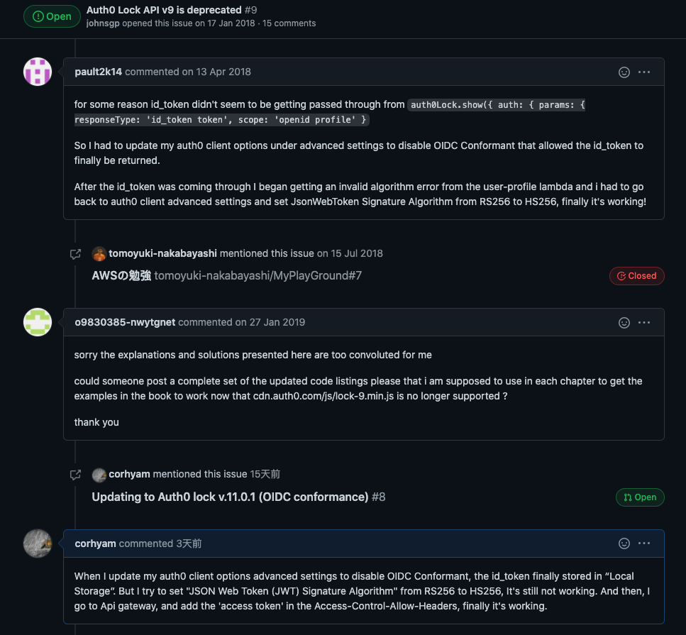
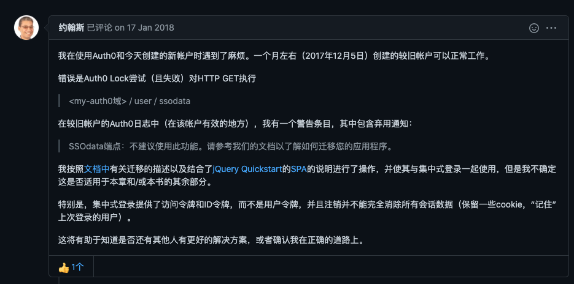
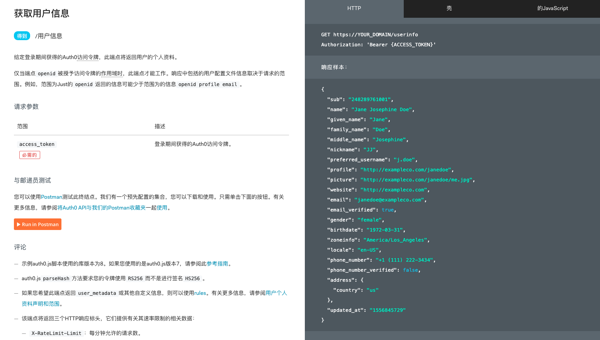
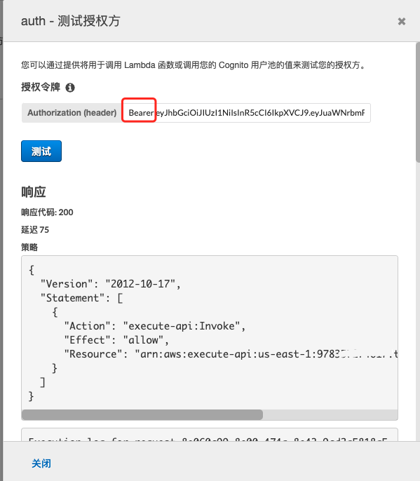
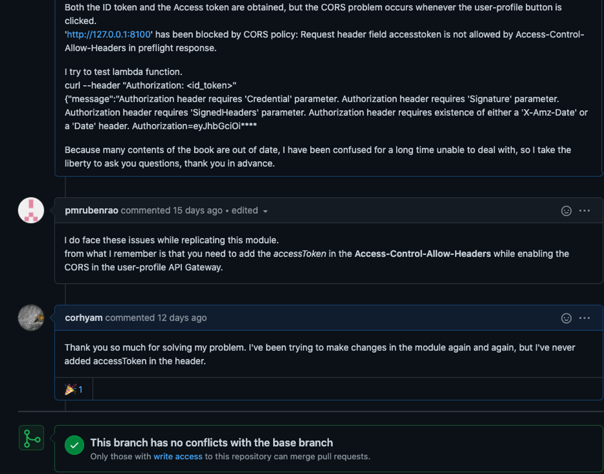
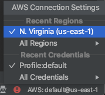
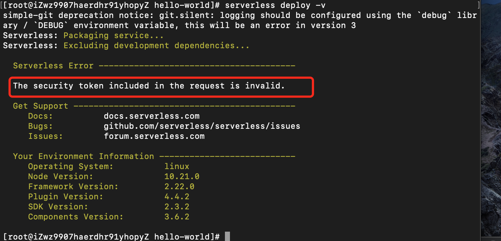
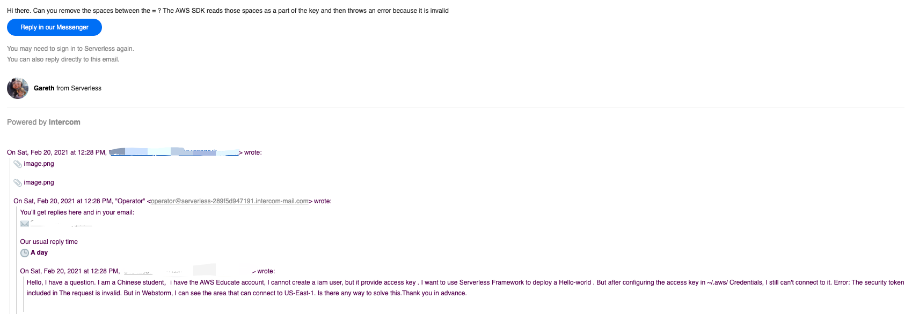

## 一、相关资料实在太少

> 在国内auth0集成AWS的教程几乎所有都已经过时了，我项目里面那么多的`auth0-outdate`项目，全都是踩坑经历，甚至连Serverless Framework的文档里面的集成auth0也是没有办法成功运行。


远远还不止这三个，一直踩这个坑的时候，想着换国内的提供商`Authing`，一个和Auth0差不多的认证提供商，但是教程实在太少，官网中的Demo有去看过，但是他需要独立出来一个网站，如果想像Auth0一样做组件弹窗又要重新去做配置，所以辗转之后，还是坚持走Auth0这条路。只能跑到stack overflow，google，虽然讨论的比国内多，但是资源仍然较少。

## 二、OIDC标准以及算法更改

> 由于Auth0以往使用的jwt签名算法都是`HS256`，但是由于更新了符合OIDC标准之后，默认的算法是`RS256`，在`authResult`的回调对象中`id_token`始终返回的都是空值null。要想获取到`id_token`，则需要取消勾选`符合 OIDC 标准`，并且把算法更改为`HS256`。
>
> 因为`jwt.verify`默认是`HS256`，当然，你也可以在函数中修改你的`algorithms`为`RS256`。



## 三、Auth0.lock插件的版本更新问题

> 网上大部分的教程都是旧版的version 9的lock.min.js，环境配置是node.js 6，很多的语法问题都有所修改，并且lock.min.js的v9也已经弃用无法使用，就算你的配置完全正确，组件能正常弹出，但是只要登陆就会给你反馈异常情况。



## 四、用户信息反馈的终端节点变化

> `Post`请求的`/tokeninfo `的API endpoint弃用了，通过该终端节点已经无法再获得用户信息。
>
> 现在想要获取用户信息需要使用`GET /userinfo`获取配置信息，并且需要在`Authorization`标头中添加访问令牌`access_token`。



## 五、自定义授权方测试

> AWS自定义授权方的函数测试，在测试的时候需要把您的`id_token`带着`Bearer`进行输入，才能成功通过测试，但是常规的jwt验证中，或者curl测试api接口时，需要把`Bearer`用`spilt()`或者其他方法去掉才行



> 除了`Authorization`标头需要映射之外，要在标头中也添加自己的`accessToken`，最初一直漏了没有启用CORS与添加到标头而导致一直调试不成功。




## 六、Serverless Framework凭证问题

> 在配置AWS凭证的时候，一直配置正确的凭证却一直反馈安全令牌invalid，但是实际上我能够和AWS进行通信，在WebStorm中能够看到已连接成功到us-east-1的情况，但是Serverless Framework的配置一直都不行。





> 多次测试无果，就去问了一下Serverless 官方的人，但是反馈给我的是Remove掉空格，但是我再三检查好像都没有空格，后来完完全全地一块又一块地把ak/sk进行配置，忽然间又可以deploy成功了。奇怪的就是我最初就能够正常与AWS通信，但是就是配置不了serverless，所以怀疑会不会是`token`最后面存在空格导致配置失败。这个问题还有待考究。




## 七、切换Serverless提供商

> 由于时区不同，并且国内是和`腾讯云`合作，所以安装完`Serverless Framework`不做配置的话默认是腾讯云的。每次deploy就会出现腾讯云的一个二维码，不过这种集成的确是腾讯云的一个优势。此次我想使用`AWS`进行部署，但是最初无论怎么调都调不过去。配置完了AWS凭证之后，依然是默认腾讯云。捣鼓了很久，在网上基本完全没有这方面的信息，官网的docs也是没有找到。后来发现就算通过Serverless配置了AWS凭证，但是他还是需要你切换提供商，就一行命令的事情，把提供商配置到环境变量中`source`一下，终于能使用AWS配置。不过国内如果使用腾讯云搭建应该是最好的，在初始化Serverless项目的时候，就有很多很多的项目可以选择，诸如vue.js,React,静态网站托管等等，他都帮你把模版弄好了。

命令如下:

```shell
export SERVERLESS_PLATFORM_VENDOR=aws
```

将其配置到`~/.bash_profile`中，在再`source`

```shell
source ~/.bash_profile
```

