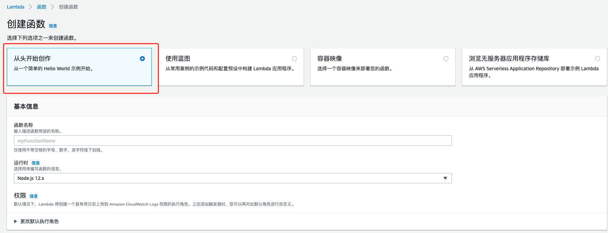
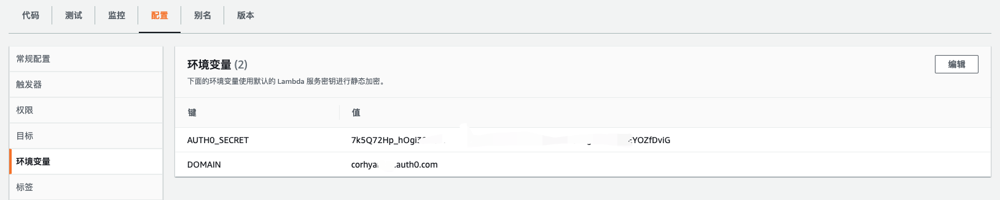

## 创建Lambda函数

目前，auth0与AWS集成，需要创建lambda函数做处理，API Gateway做入口。

个人的网页大致逻辑是这样的：用户点击登陆按钮，调用auth0.lock页面进行登陆，在登陆成功之后，在浏览器LocalStorage中会保存相对应的`id_token`与`accessToken`。获取这些令牌之后，当用户点击用户信息按钮，向API Gateway发出请求，把密钥通过`Request header`进行发送。Lambda函数接收网站的`JsonWebToken`之后，使用jwt.verify进行校验，并通过accessToken访问auth0中的API，返回用户信息。

---


### user-profile函数



- 前往AWS控制台中，点击Lambda服务
- 点击`创建函数`按钮，并选择从头开始创作，创建
- 将函数命名为你自己想要的名字，此处为`user-profile`。

---


在本地IDE中，建立函数，配置`package.json`依赖。

因为需要使用到`jsonwebtoken`以及`request`库。

所以在`Terminal`中切换到函数目录中运行命令：

```bash
npm install jsonwebtoken --save
npm install request --save
```

你配置好`package.json`后运行npm install也是可以的。

jsonwebtoken用于jwt相关的实现，request库用于请求Auth0的api接口。

## package.json

```json

{
  "name": "user-profile",
  "version": "1.0.0",
  "description": "This Lambda function returns the current user-profile",
  "main": "index.js",
  "scripts": {
    "deploy": "aws lambda update-function-code --function-name user-profile --zip-file fileb://Lambda-Deployment.zip",
    "predeploy": "zip -r Lambda-Deployment.zip * -x *.zip *.json *.log"
  },
  "dependencies": {
    "jsonwebtoken": "^5.7.0",
    "request": "^2.88.2"
  },
  "devDependencies": {
    "run-local-lambda": "^1.0.0"
  }
}
```

上方代码为package.json代码，`scripts`中的`deploy`用于部署代码至lambda函数。

> 运行命令`npm run deploy`即可部署代码至AWS Lambda中

!> 与ServerlessFramework不同，此处做法是使用AWS CLI进行部署的，若使用Serverless Framework，可以在本地写完代码做好配置，编写serverless.yml之后deploy上去即可帮你创建资源并部署函数。此处AWS CLI仅用于把lambda函数代码进行部署，并保存副本到AWS S3中。

---

## index.js

```javascript
//这个js主也要负责令牌的校验和解码，成功则向auth0提供的userinfo endpoint发送请求。
// jwt也包含在请求中，userinfo返回用户信息，发回网站。大致思路 auth0旧的Tokeninfo弃用了
'use strict';

var jwt = require('jsonwebtoken');
var request = require('request');

exports.handler = function(event, context, callback){
    if (!event.authToken) {
        callback('Could not find authToken');
        return;
    }

    var id_token = event.authToken.split(' ')[1];//取id_Token的值 拆分后第二个
    var access_token = event.accessToken;

    var secretBuffer = new Buffer(process.env.AUTH0_SECRET);
    jwt.verify(id_token, secretBuffer, function(err, decoded){
        if(err){
            console.log('Failed jwt verification: ', err, 'auth: ', event.authToken);
            callback('Authorization Failed: ' + id_token + ", error: " + err + ", auth: " + event.authToken);
        } else {

            var body = {
                'id_token': id_token,
                'access_token': access_token
            };

            var options = {
                url: 'https://'+ process.env.DOMAIN + '/userinfo',
                method: 'GET',
                json: true,
                body: body
            };

            request(options, function(error, response, body){
                console.log("Response0: " + JSON.stringify(response));
                if (!error && response.statusCode === 200) {
                    console.log("Response1: " + JSON.stringify(response));
                    callback(null, body);
                } else {
                    callback(error);
                }
            });
        }
    })
};
```

> index.js用于负责令牌的校验和解码，如果成功，则向Auth0的`/userinfo`节点发送请求，返回用户信息至网页。


## 环境变量配置

一些隐私的，不方便添加到函数中的配置，可以把他们配置到环境变量中，避免嵌入到函数中，类似auth0的client id，域名等。配置在环境变量后，可以在函数中通过process.env进行获取。在`Lambda`函数中下方`配置`选项卡中进行配置



---

---

## 更新问题

!> 由于Auth0做了更新，在高级设置`Advanced settings`中默认勾选符合OIDC规则（OIDC Conformant），现在由于默认勾选了，`id_token`便会无法获取authResult会一直返回空值。并且auth0中JWT的签名算法默认为`RS256`。后续index.js实现函数中的`jwt.verify`默认是`HS256`算法。

!> 所以此处需要前往`高级设置`中取消勾选（OIDC Conformant），并且把`RS256`算法修改为`HS256`，以获取`id_token`并让令牌校验函数正常运行。