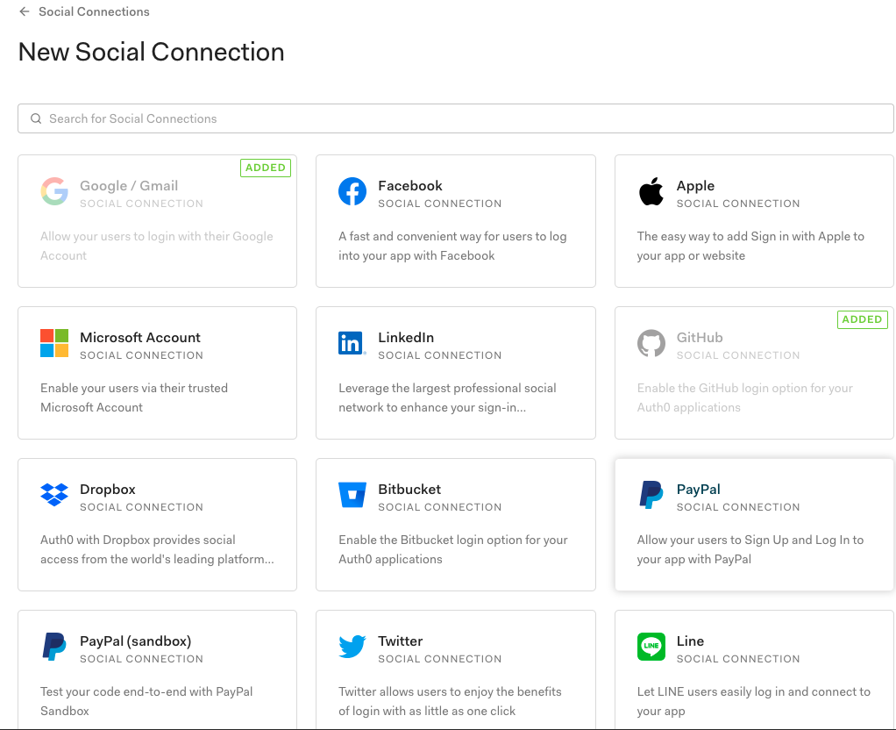
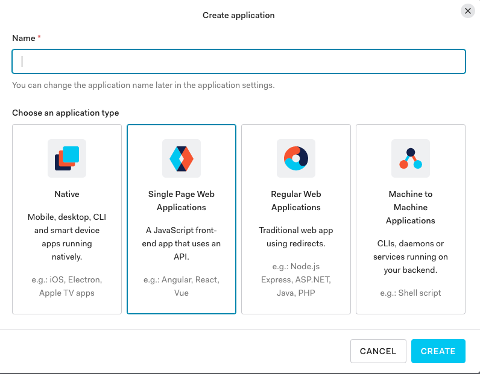
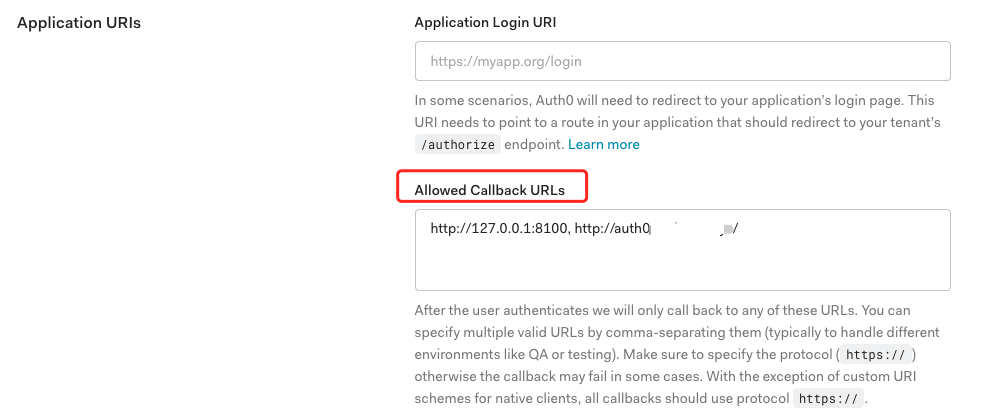

## 注册Auth0账号

访问Auth0官网进行注册，https://auth0.com/

> 根据个人情况进行注册，使用邮箱，或者Github，Google，Microsoft进行sign up。

填写自己的相关信息，并选择一个区域（由于在国内，我个人选择了jp日本区域，可以根据实际情况进行修改）。账号创建好登陆之后进入到控制台中，可在Authentication->Social中选择你需要的身份认证类型，添加GIthub，Google等Social Connections。

之后，新建您自己的一个应用程序，点击`Applications`选项创建自己的应用，根据自己的需求进行选择。

此后可以选择`快速开始`选项，将会跳转到文档页面，文档中含有教程，阐述如何为你的网站配置Auth0页面或Auth0.lock插件。

---

> 在Settings选项卡中，使用auth0需要配置一些选项，不然会出现CORS相关的异常。
>
> - 在Allow Callback URLs中添加您对应的网站（此处个人本地调试地址为127.0.0.1:8100，以及域名地址，所以都添加并用·,·逗号隔开）
> - 在`Allow Origins(CORS)`中也同样添加自己的链接，否则会不允许跨域请求，github相关的登陆无法调用。
> - 点击`save change`保存自己的修改。

>  到此，Auth0的配置基本完成了。

---

## Auth0中实现Github登陆

若想在auth0界面中实现github登陆，则需要在github创建一个新的OAuth应用。

>登陆自己的Github，`settings`->`Developer settings`->`OAuth Apps`进行创建。

> 而后配置自己的`Homepage URL`以及`Authorization callback URL`
>
> **需要根据自己auth0中的域名进行配置**

此处我的配置是：

>**Homepage URL：**`https://corhyam.jp.auth0.com`
>
>**Authorization callback URL：**`https://corhyam.jp.auth0.com/login/callback`

之后，把生成的`GitHub ID`和`Client Secret`填入到auth0中的github配置中，配置即完成。

---

---

## 更新问题

!> 由于Auth0做了更新，在高级设置`Advanced settings`中默认勾选符合OIDC规则（OIDC Conformant），现在由于默认勾选了，`id_token`便会无法获取authResult会一直返回空值。并且auth0中JWT的签名算法默认为`RS256`。后续index.js实现函数中的`jwt.verify`默认是`HS256`算法。

!> 所以此处需要前往`高级设置`中取消勾选（OIDC Conformant），并且把`RS256`算法修改为`HS256`，以获取`id_token`并让令牌校验函数正常运行。

> **如部署期间遇到问题可留言。如有错误之处，还请予指正。**