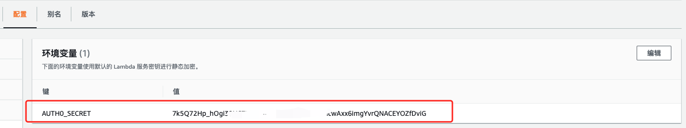
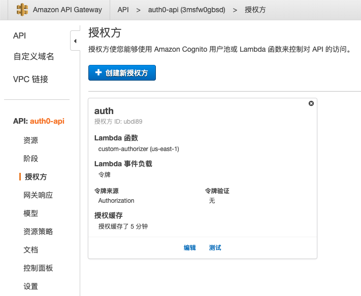

## API Gateway 自定义授权方


API Gateway中授权方设置中，有两种选项，一种是Lambda函数，一种是Amazon Cognito。Cognito是AWS中的身份验证，用户管理服务，但是由于访问速度问题以及一些配置十分繁琐，所以使用Auth0来做认证提供商，使用Lambda函数作为自定义授权方。**此外，因为目前学习Serverless架构，Serverless有一个思想就是，不断地拥抱第三方服务，站在巨人的肩上达到新的高度。第三方服务能更好的提供价值，自然便会配合他进行使用。**

在该项目中，添加了自定义授权方后，大致的逻辑是这样的：

> 网站发送请求 -->API网关中自定义授权方进行令牌校验 --> 返回IAM策略 --> IAM策略允许 --> 触发user-profile函数


当请求到API Gateway的时候会先自定义授权方传入令牌进行校验，若策略允许则继续进行调用lambda函数，不允许则返回401`Unauthorized`。

---

## Lambda实现自定义授权方

要实现自定义授权方，大致步骤如下：

- 1、创建一个`Lambda`函数。
- 2、编写一个自定义授权方函数并进行部署。
- 3、在`API Gateway`的`授权方`选项卡中中新建授权方，选择该lambda函数作为授权方。

---


### 创建lambda函数

与上一章user-profile函数的创建方法一样。


- 前往AWS控制台中，点击Lambda服务
- 点击`创建函数`按钮，并选择从头开始创作，
- 将函数命名为你自己想要的名字，此处为`custom-authorizer`。

---


在本地IDE中，建立函数，配置`package.json`依赖。

因为需要使用到`jsonwebtoken`库。

所以在`Terminal`中切换到函数目录中运行命令：

```bash
npm install jsonwebtoken --save
```

### package.json

package.json与user-profile中的配置基本一致，只是修改了名称，并且自定义授权方函数中不需要`request`库。

```javascript
{
  "name": "custom-authorizer",
  "version": "1.0.0",
  "description": "This Lambda function is used to authorize requests",
  "main": "index.js",
  "scripts": {
    "deploy": "aws lambda update-function-code --function-name custom-authorizer --zip-file fileb://Lambda-Deployment.zip",
    "predeploy": "zip -r Lambda-Deployment.zip * -x *.zip *.json *.log"
  },
  "dependencies": {
    "jsonwebtoken": "^5.7.0",
    "request": "^2.88.2"
  },
  "devDependencies": {
    "run-local-lambda": "^1.0.0"
  }
}

```


上方代码为package.json代码，`scripts`中的`deploy`用于部署代码至lambda函数。

> 运行命令`npm run deploy`即可部署代码至AWS Lambda中。

!> 与ServerlessFramework不同，此处做法是使用AWS CLI进行部署的，若使用Serverless Framework，可以在本地写完代码做好配置，编写serverless.yml之后deploy上去即可帮你创建资源并部署函数。此处AWS CLI仅用于把lambda函数代码进行部署，并保存副本到AWS S3中。


### index.js

```javascript
'use strict';

var jwt = require('jsonwebtoken');
//generatePolicy方法用于生成一个IAM的策略，根据生成的是 'Allow' 或者 'Deny' 来判断，该用户是否拥有权限。
// 策略规定api gateway可调用的资源
var generatePolicy = function(principalId, effect, resource) {
    var authResponse = {};
    authResponse.principalId = principalId;
    if (effect && resource) {
        var policyDocument = {};
        policyDocument.Version = '2012-10-17';
        policyDocument.Statement = [];
        var statementOne = {};
        statementOne.Action = 'execute-api:Invoke';//若想再加访问控制，可以添加S3 policy。
        statementOne.Effect = effect;
        statementOne.Resource = resource;
        policyDocument.Statement[0] = statementOne;
        authResponse.policyDocument = policyDocument;
    }
    return authResponse;
}

exports.handler = function(event, context, callback){
    if (!event.authorizationToken) {
        callback('Could not find authToken');
        return;
    }

    var token = event.authorizationToken.split(' ')[1];
    //const AUTH0_CLIENT_PUBLIC_KEY = new Buffer(process.env.AUTH0_CLIENT_PUBLIC_KEY);//这里测试一下用public key能不能解码
    var secretBuffer = new Buffer(process.env.AUTH0_SECRET);//可以通过环境变量获取 在lambda里面配了
    jwt.verify(token, secretBuffer, function(err, decoded){//根据 AUTH0 的 ID 和密钥来校验 token 是否是有效
        if(err){
            console.log('Failed jwt verification: ', err, 'auth: ', event.authorizationToken);
            callback('Authorization Failed');
        } else {//判断令牌是否有效 有git效就返回个策略
            callback(null, generatePolicy('user', 'allow', event.methodArn));
        }
    })
};

```

> 自定义授权方的`index.js`用于对令牌进行校验，若判断令牌有效，则会返回一个允许API进行调用的执行策略，用于触发后续的函数。

### 环境变量

由于`AUTH0_SECRET`这一类不方便直接在函数中填入的数据，可以把其配置到环境变量中。配置完之后，可以在函数中通过process.env进行获取。环境变量在Lambda函数的下方`配置`选项卡中进行配置。



---

## API Gateway设置授权方

- 前往`API Gateway`控制台中，选择到自己设置的API。
- 点击`资源`选项卡下的`授权方`选项。
- 点击`创建新授权方`。
- 填写`名称`，类型选择`Lambda`
- 选择自己函数的区域，函数选择自定义授权方函数`custom-authorizer`。
- 令牌来源填写`Authorization`。 （以前是`method.request.header.Authorization`，现在填写`Authorization`）
- 点击`创建`。



- 最后，前往`资源`选项卡中，
- 点击`GET`方法中的`方法请求`。
- 在`授权`下拉选项中选择`自定义授权方`。
- 记得点击选项右边的:heavy_check_mark:！！！！
- 然后点击`操作`选项下的`部署API`。
- 选择`dev`，然后进行`部署`。


> 至此，配置已完成。您可以在`自定义授权方`中`测试`按钮进行测试，添加id_token进行测试，或者在页面中登陆后点击用户信息按钮，查看是否能够返回你的用户信息。

!> 在自定义授权方中进行测试的话，`id_token`需要连着`bearer`一起填入才能测试成功，仅令牌值不行。


> 如部署期间遇到问题欢迎交流。如有错误之处，还请予指正。**

