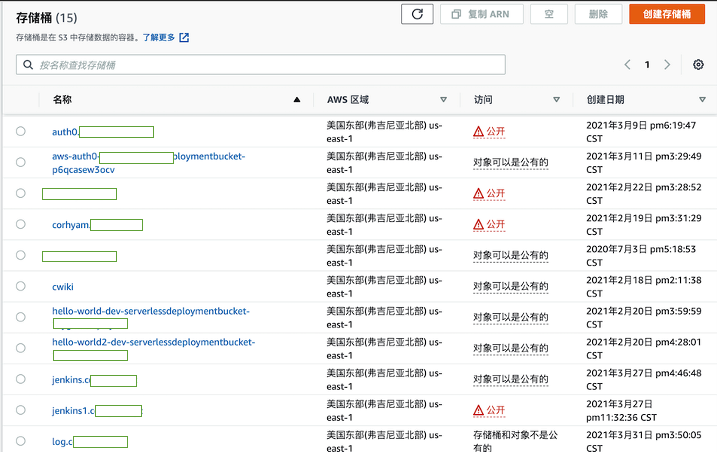
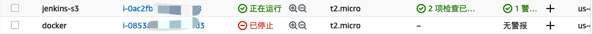
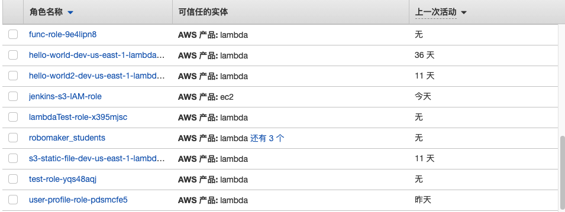
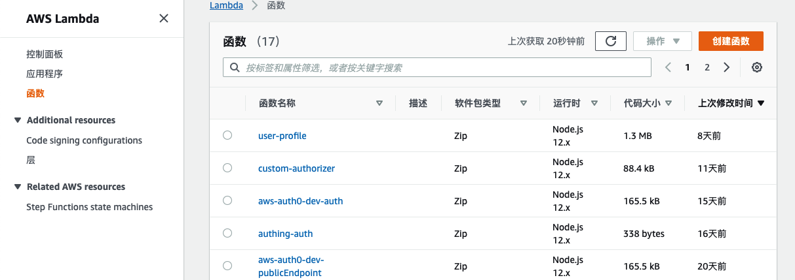
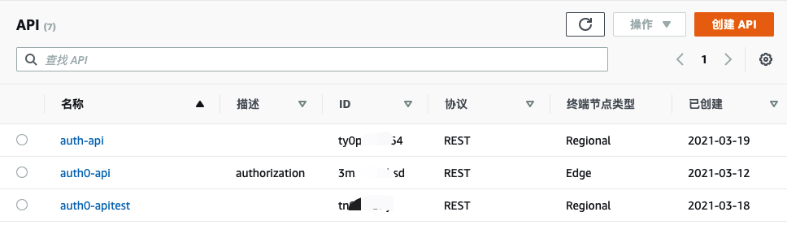
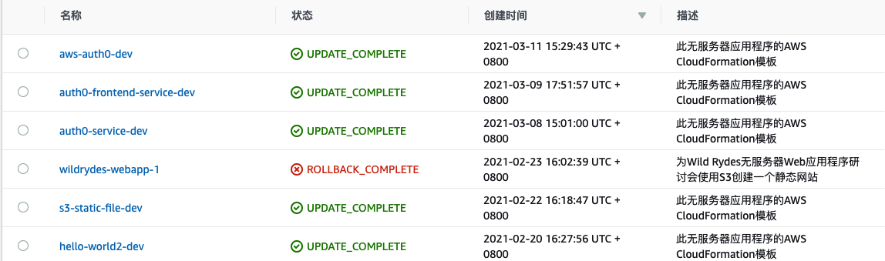

## AWS S3静态存储

> 由于AWS Educate账号只能在弗吉尼亚北部(us-east-1)使用，所以存储桶都是在美东区域创建，该页面部分信息模糊处理，各存储桶用于实现静态网站托管，Lambda函数代码保存，静态图片保存，Jenkins持续部署测试，网站日志收集。
>
> **除非是用做网站托管，否则尽量不要公开访问**，若静态网站托管在Cloudfront加入鉴权层，则可以关闭S3公开访问，走cloudfront做分发。

## AWS EC2计算服务

>服务器主要用做使用docker实现Jenkins的CI/CD，实例规格较小。

## IAM角色

>IAM角色主要创建了Lambda execute角色，S3访问权限角色，以及EC2访问S3的角色。

## AWS Lambda函数

>Lambda函数主要用于自定义授权功能，以及展示用户信息功能。
>
>User-profile为用户信息配置，Custom-authorizer为自定义授权方，名称包含auth0以及authing相关的函数为与第三方认证授权方时测试用的函数。

## API Gateway

 >主要使用auth-api，该api用做入口。其余api皆为测试用。

## AWS CloudFormation

>主要使用Serverless Framework做创建，Serverless Framework部署的时候会把serverless.yaml转换成cloudformation的template。然后创建资源。

