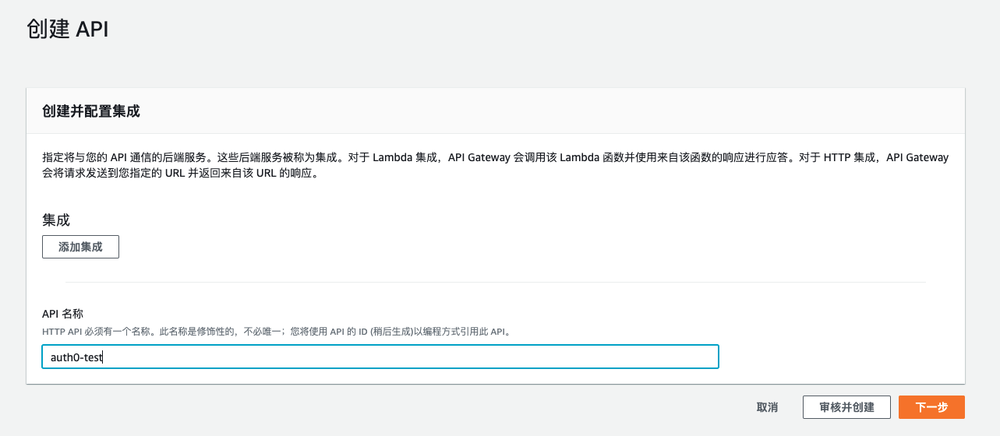
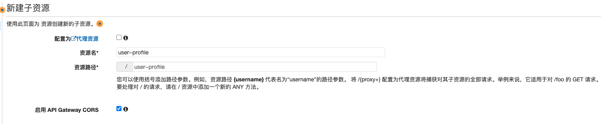
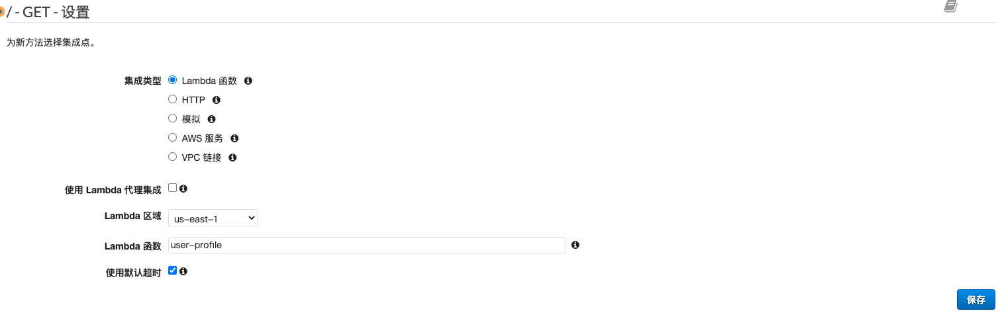
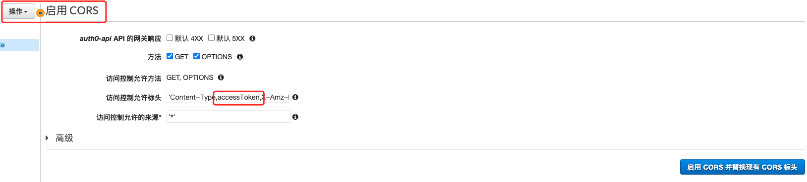
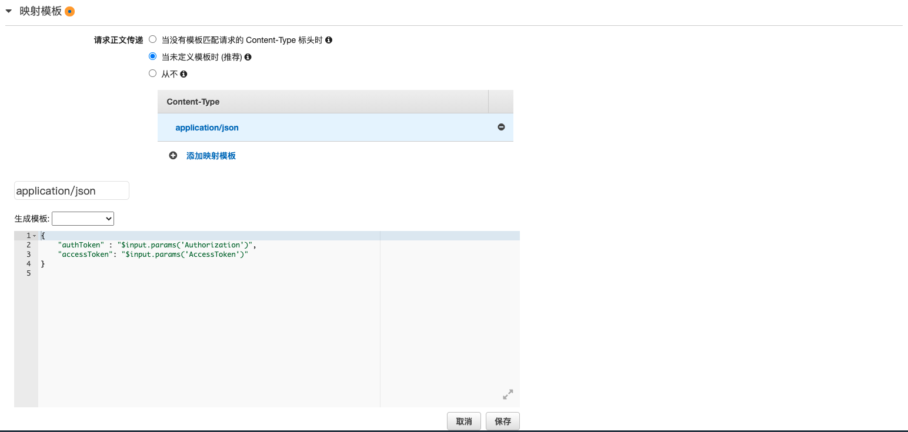
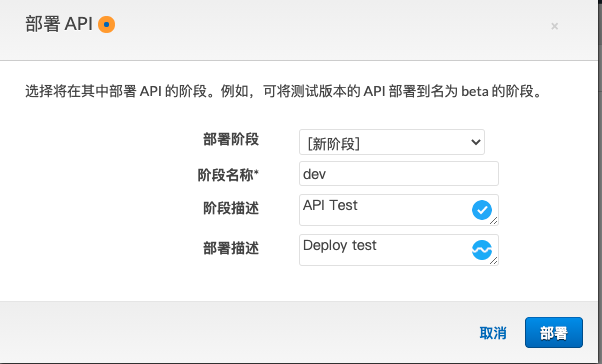
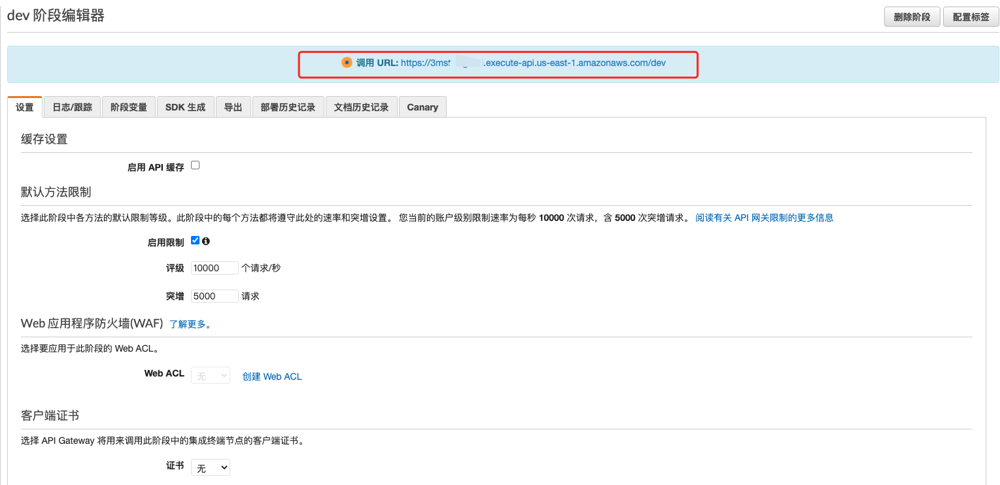

## 创建API Gateway

要调用Lambda函数，最好的方法就是建立一个API Gateway进行管理，接受来自网站的请求。

> 网站发出请求->API Gateway接受请求->调用Lambda函数user-profile->返回用户信息到网站

- 前往AWS控制台，选择API Gateway服务。
- 点击创建API，选择你需要的API类型（HTTP API，REST API，Websocket API）
- 输入您的API名称，并点击`创建`。




---


## 创建资源并配置

- 点击`操作`按钮，选择`创建资源`。
- 在`资源名`一栏中填写你的资源名字，（此处本人填写为`user-profile`），填写完`资源名`后，资源路径会自动补齐。
- 点击`创建资源`，资源则创建成功，资源列表中会出现`/user-profile的`的标签。

!> **记得启用CORS！！！！！(重要)**




- 选中资源`/user-profile`，点击`操作`按钮。
- 选择`创建方法`选项卡，新建一个`GET`方法。
- 下拉选择`GET`，并保存。会出现集成请求设置面板。




- 在`集成请求`页面中，集成类型中选择`Lambda函数`。
- 在Lambda区域 选择自己的区域。
- Lambda函数 选择需要触发的函数。（此处本人调用user-profile函数）。
- 点击保存按钮，如果询问是否可以向Lambda函数添加权限，则点击`确定`即可。

---

## 启用CORS

> 在创建资源时，若未选择启用CORS，可以在`操作`按钮中启用，否则会出现跨域异常。之前一直调试都是在捣鼓跨域异常问题。

- 点击`操作`，选择`启用CORS`。
- 进入到配置页面，在访问控制允许标头添加`accessToken`，并确保`Authorization`包含在内。

!> **以前的情况是可以保持默认情况。但是由于Auth0目前的一些变化，导致以前的一些终端节点不可用，需要的token也不同，所以在此处，需要在访问控制允许标头中添加`accessToken`，后面会编写映射模版做`accessToken`与`Authorization`的映射。（此处添加accessToken很重要，本人由于疏忽一直没做添加导致卡了很多很多天。）**




---

## 创建映射

> index.js代码中存在着调用`authToken`的代码，实际上是网站通过`Authorization`和`accessToken`标头传入相关的JWT令牌，通过API Gateway映射之后进行参数传递到AWS lambda的。lambda函数中通过`event.authToken`获取。


- 点击`/user-profile`中的`GET`方法，点击`集成请求`。
- 点开最下方的`映射模版。`
- 点击`添加映射模版`，并输入`application/json`后点击右方的按钮。
- 如果弹出`更改传递行为`对话框，则点击`是，锁定此集成`按钮即可。
- 在下方模版编辑文本框中，填写下方代码并保存。


```json
{
    "authToken" : "$input.params('Authorization')",
    "accessToken": "$input.params('AccessToken')"
}

```




---


## 部署API

当前置的配置都已完成之后，就可以部署你的API，获取可从网站进行调用的URL。

- 选中自己的API，点击`操作``。
- 选择`部署 API` 选项。
- 选择`新阶段` 选项，输入`dev`作为阶段名称。
- 点击`部署`。






> 而后，则可以看到`调用URL`，以及其他的配置，此处URL在user-profile的前端代码中需要使用。

在config.js中配置了调用URL后，在user-controller.js中，此处为 show profile 按钮的点击事件调用，在点击按钮的时候通过api gateway调用Lambda中的user-profile函数，并返回用户信息到页面中。

```javascript
//点击事件
this.uiElements.profileButton.click(function(e) {
  var url = that.data.config.apiBaseUrl + '/user-profile';

  $.get(url, function(data, status) {

    alert(JSON.stringify(data));

    $('#user-profile-raw-json').text(JSON.stringify(data, null, 2));
    $('#user-profile-modal').modal();
  })
});
```

此处添加了alert和modal进行显示。不需要alert可进行注释。

详细代码可查看：https://github.com/corhyam/serverless-wiki/tree/master/auth0-custom-authorizer


> **如部署期间遇到问题可留言交流如有错误之处，还请予指正。**