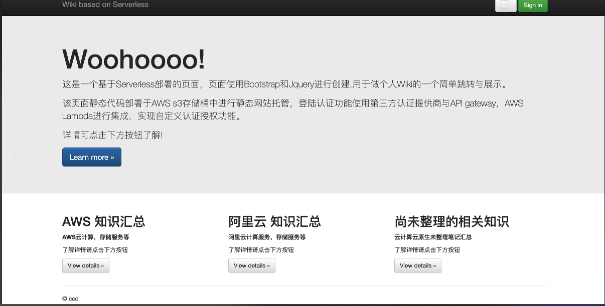
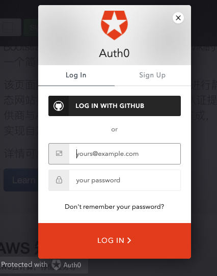
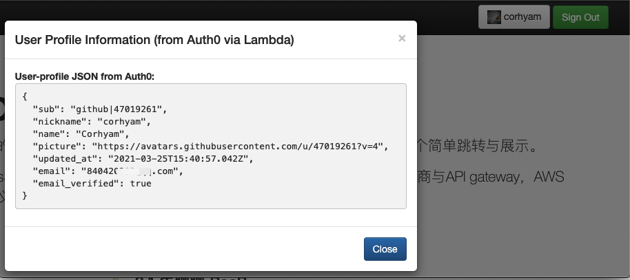

## 展示页面

http://auth0.corhyam.xyz/

>该页面主要用做等跳转与授权登陆，根据需要跳转到不同的知识页面中。Learn more跳转至corhyam.xyz页面，其余按钮跳至对应的子页面。
>
>右上角白色按钮为用户信息按钮，**常规情况下为登陆状态是隐藏的，由于做认证测试，所以把它显示出来**，绿色按钮Sign in为登陆按钮。

>**此处做授权登陆的想法是，在此处使用了github登陆的话，则后续页面中的gitalk评论功能就不需要再做登陆了。**

## Auth0.lock页面

>点击sign in登陆按钮，则会弹出对应的auth0登陆页面，集成在网页中。

## 自定义授权与用户信息

> 由于自定义授权以及userprofile使用lambda函数，在不需要调用时不会触发，在第一次触发时则会冷启动。由于长时间没调用过函数且并没有登陆，根据Serverless的特性，则会显示500状态码。若已登陆且令牌未到期则返回200状态码，若函数仍活跃情况下注销账号再次点击，则会触发401状态码Unauthorized。
>
> **该情况后续更新详细文档进行解释。**

**登陆之后，点击用户信息则显示用户信息内容**

