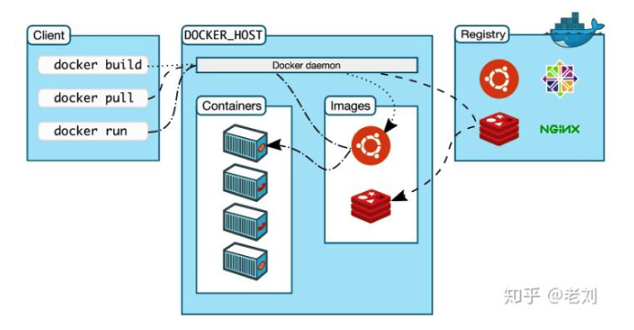

微服务https://www.zhihu.com/question/65502802/answer/802678798?utm_source=wechat_session&utm_medium=social&utm_oi=790101383931113472&utm_content=group2_Answer&utm_campaign=shareopn

ansible一台host管理多台客户端 类似一个主机发出命令让其他所有的主机执行然后返回数据

jenkins开发直接上传部署项目 CI/CD

docker内部操作系统登陆命令。

当nginx镜像没有打包ps命令

**apt-get update && apt-get install procps** 

docker容器内部的ps命令安装 原本是ps不了的

操作系统：进程可见，可相互通信，共享同一份文件系统。存在资源的抢占问题。

容器：同样的文件系统进行隔离 unix和linux提供一个叫**chroot**（changeroot）的一个系统调用，他可以把子目录变成根目录 在视图级别隔离。在**chroot**帮助下可以有一个独立的文件系统。  **namespace技术** 帮助对进程进行隔离 资源的视图上隔离。 在chroot和namespace下可以提供一个独立的环境

**cgroup**来限制他的资源的使用率 这个进程只能使用2g内存 或者只能使用4个CPU 

在这几个技术下能够提供一个相对独立的环境

发现有一个线程，打开它：

docker attach 【CONTAINER ID或NAMES】

退出时如果想继续运行：按顺序按【ctrl+p】，【ctrl+q】

如果不想继续运行：按【ctrl+d】或输入exit

 

关闭后重启请输入：docker restart 【CONTAINER ID或NAMES】

中间的是docker后台运行的服务，一个称为docker daemon的守护进程。可以理解为我们mysql的服务，我们的操作命令都是在这部分进行处理！docker deamon监听着客户端的请求，并且管理着docker的镜像、容器、网络、磁盘（图中只列出了镜像与容器）等对象。同样，docker的客户端与服务可以运行在同一机器上，也可以用某台机器上的客户端远程连接另一台机器上的docker服务，这跟我们的mysql一样的呢。

https://www.cnblogs.com/sujing/p/11012115.html

运行容器所需要的所有文件集合就是 **容器镜像**

通常通过Dockerfile来构建镜像

构建步骤所产生出文件系统的变化-changeset

golang是基于alpine的 所以镜像之间可以相互复用

镜像设计成分层服用  chgeset带来的分层和复用带来了优点：

**大的镜像文件 可以拆分成小块 提高分发效率 并行下载。**

**因为数据相互共享，当本地存在的时候 可以下载不存在的文件即可。**

**镜像数据共享，节省磁盘空间**

右图就是dockerfile

拥有dockerfile之后 docker build命令来构建application 存储在本地

要运行在生产或者测试环境的话 就要借助 中转站 中心存储是dockerRegistry存储所有的镜像数据

借助docker push能把本地镜像推到镜像仓库中

docker pull命令下载到本地

docker images 看本地有什么镜像

docker run 运行镜像

最后的top命令 用于查看对应的进程是top命令

一次构建到处运行。build once ，run anywhere

容器是具有隔离特性的进程集合，docker run提供独立的文件系统以及指定相应的运行程序 init进程。

init进程生命周期=容器生命周期（initial）

docker exec -it （id） bash

当init进程退出，所有子进程也退出 防止进程泄露

当删除时数据也会丢失 类似里面的redis mysql 所以要让容器中产生的数据持久化到宿主机上

持久化在数据卷

docker volume vs bind 帮助容器进行持久化

容器数据卷的设计目的就是做**数据的持久化**和**容器间的数据共享**，数据卷完全独立于容器的生命周期，也就是说就算容器关闭或者删除，数据也不会丢失。简单点说就将宿主机的目录挂在到容器，应用在容器内的数据可以同步到宿主机磁盘上，这样容器内产生的数据就可以持久化了。关于容器卷的命令我们后面会有操作实例！

分布式：

https://www.cnblogs.com/sujing/p/11006424.html

 CAP理论是由加州大学Eric Brewer教授提出来的，这个理论告诉我们，一个分布式系统不可能同时满足一致性(Consistency)、可用性(Availability)、分区容错性(Partition tolerance)这三个基本需求，最多只能同时满足其中两项。

  **一致性**：这里的一致性是指数据的强一致，也称为线性一致性。是指在分布式环境中，数据在多个副本之间是否能够保持一致的特性。也就是说对某个数据进行写操作后立马执行读操作，必须能读取到刚刚写入的值。（any read operation that begins after a write operation completes must return that value, or the result of a later write operation）

  **可用性**：任意被无故障节点接收到的请求，必须能够在有限的时间内响应结果。（every request received by a non-failing node in the system must result in a response）

  **分区容错性**：如果集群中的机器被分成了两部分，这两部分不能互相通信，系统是否能继续正常工作。（the network will be allowed to lose arbitrarily many messages sent from one node to another）

  在分布式系统中，分区容错性是基本要保证的。也就是说只能在一致性和可用性之间进行取舍。一致性和可用性，为什么不可能同时成立？回到之前修改列表的例子，由于数据会分布在不同的网络分区，必然会存在数据同步的问题，而同步会存在网络延迟、异常等问题，所以会出现数据的不一致！如果要保证数据的一致性，那么就必须在对写库进行操作时，锁定其他读库的操作。只有写入成功且完成数据同步后，才能重新放开读写，而这样在锁定期间，系统丧失了可用性。更详细关于CAP理论可以参考[这篇文章](https://mwhittaker.github.io/blog/an_illustrated_proof_of_the_cap_theorem/)，该文章讲得比较通俗易懂！

**削峰的做法**

组件都会和API Server连接 组件与组件之间不进行独立的连接 通过apiserver做连接

controller 集群管理 容器修复，水平扩张。

Node中的kubelet负责看容器是否始终符合健康运行状态。node挂了之后重新创建新的，controller负责去监控是否健康，不健康就向api server发出请求，再去调度。controller需要loop循环，周期性探测管理的容器是否健康。

控制器可以控制很多节点 控制器挂了怎么监控。所以需要controller manager，监控控制器健康。controller manager做到冗余。

master是集群的大佬

最小运行单位是pod，容器的外壳，给容器做了抽象的封装，最小的调度逻辑单元。在pod里 多个容器共享同一个网络名称空间 **net uts和itc ？而且pod内容器共享存储卷**

pod是模拟传统的虚拟机。

selector是根据标签来过滤符合条件的资源兑现的机制，不仅pod，很多资源能用。标签选择器。

k8s是rest风格 通过http和https对外提供服务，所以所有都是对象，对象都能用标签，就能用标签选择器。

kubelet 集群代理，调度的结果就让kubelet执行。

scheduler 调度操作 用户提交给container 找合适的节点进行放置 根据容器最低需求 评估。评估多少个符合，k8s设计了两级调度，先预选 看多少个符合容器运行需求，之后优选 选择最佳适配。假设要1个 但是有3个 之后就看你的调度算法中的优选算法选择最佳适配的。

etcd 分布式存储系统 apiserver中所需要的元信息存放在里面 高可用性

两三个主节点 主节点为唯一入口 node就是运行容器的结点

客户端创建容器请求先发给master，master中的调度器分析现有可用资源状态，根据最佳适配让node本地的docker 把容器启动起来。镜像看本地有没有 没有就拖下来dockerhub registry

Registry也可以托管在kubernetes上 做镜像仓库    自托管可以让k8s运行在k8s之上

nexus：

**1、 为什么使用Nexus**

​    如果没有私服，我们所需的所有构件都需要通过maven的中央仓库和第三方的Maven仓库下载到本地，而一个团队中的所有人都重复的从maven仓库下载构件无疑加大了仓库的负载和浪费了外网带宽，如果网速慢的话，还会影响项目的进程。很多情况下项目的开发都是在内网进行的，连接不到maven仓库怎么办呢？开发的公共构件怎么让其它项目使用？这个时候我们不得不为自己的团队搭建属于自己的maven私服，这样既节省了网络带宽也会加速项目搭建的进程，当然前提条件就是你的私服中拥有项目所需的所有构件。

ansible应用编排工具 完成对多种应用程序反映在ansible。reboot方法执行 能够实现把手动的实现的编排转化成应用程序本身能够实现的功能。 注入到应用程序中 （面向多台主机执行）

docker compose 编排工具 单机编排 面向一个docker host来进行编排工作

docker swarm 整理多个平台的docker host 整合在一起 整合成资源池 docker compose只要面向docker swarm进行编排就行了

Docker machine将主机迅速初始化为 满足加入到docker swarm集群的预处理工具

三剑客

Mesos  是idc的操作系统 把idc中的资源统一调度和分配。非能够直接托管运行容器的，所以需要一个提供一个面向容器编排的框架 marathon（马拉松）

kubernetes

devops microservice，blockchain

瀑布-敏捷-精密-devops

devops 应用模式的开发

微服务 把东西都拆分成微型服务 只做一件事 调用复杂，如何确保调用者和被调用者存在，天然跟容器，利用容器的特性分发，构建，迅速找到了一个适用于自己落地的实施方案

异构环境使得部署起来困难 容器弥补了 所以devops容易实现了

CI 持续集成 Continuous Integration  发布模型蓝绿 灰度 滚动 

CD 持续交付 Continuous delivery

CD 持续部署 Continuous deployment

Plan—>架构设计—>开发—>构建—>测试｜｜  运维

写代码后续的过程能自己生成 叫持续集成。利用git

代码提交到代码工具后 代码工具看到之后自动触发，自动去构建，构建完之后再被测试构建部署到测试环境中测试。构建或测试有问题 就报告给程序员。

整个环节需要人工参与的就是开发 或者是一些特别需求的测试。

开发一些自动化测试工具 

交付给运维 自动打包共享仓库中 构建好的最终产品 就叫做持续交付 

假设部署不需要你去做 自动触发发布到先上去 就是持续部署 

打通了运维和开发的边界 这种就是Devops

容器编排工具的实现 让这些容易落地了

构建 面向平台，没办法通用 自动构建自动交付的环节特别困难，不同的目标环境都需要弄实用的版本，如今只要目标平台只要能运行容器，只要做镜像运行就可以了，容器技术使得devops实现迎刃而解。

容器运行起来 哪些容器需要内部通信，哪些需要外部通信，谁对谁有依赖。所以需要有容器编排工具来实现。

这些技术就糅合在一起了。

------

**Packer:为快速制作镜像而生**

Packer通过一个模板文件来创建基于云平台一致的自定义镜像，通过用户定义的个性化镜像，实现快速创建新的虚拟机运行实例。就和Docker中的Dockerfile类似，通过文件的方式来定义一个自定义镜像，并且Packer可以帮助用户去验证镜像可用性。

Packer的工作流程很简单：

先启动实例

上传并运行用户的脚本或者通过其他Puppet/Chef配置管理工具，定制实例的环境

对实例打快照

最后再根据快照生成镜像。

有了Packer做的镜像之后，当然就是在用这个镜像来创建可用的实例啦。

**Terraform:为把控云服务生命周期而生**

操作云服务，其中一种方法就是利用云平台提供的各类API来进行操作，这个时候Terraform出现了，他的出现帮助你省去了写大量复杂的操作云平台代码的过程，取而代之的是通过目的式的操作，通过模板编排的方法，维护了一份云服务状态的模板，而不需要在意到底用什么API命令来做到。

虚拟机镜像打包 Packer

配置管理及安全加密 Ansible

基础设施的创建和编排 Terraform

ansible——运维管理，一台host管理多个guest，命令行

Jenkins——自动化各种任务，包括构建、测试和部署软件

Ansible把登录密钥给host，然后在host加入客户端的IP即可

高可用部署架构：

https://baijiahao.baidu.com/s?id=1652056823304220090&wfr=spider&for=pc

图片未补充