## 一、思路介绍
由于个人Wiki代码基本都为静态代码，函数代码都已放至AWS Lambda中。静态代码以及静态文件存放在对象存储中。
为了省心省事，不用每次push代码上Github后仍需自己再部署一遍，所以就通过Jenkins来实现把代码推送到S3中实现简单的CI/CD。


## 二、Jenkins配置
## 2.1、前置条件

启动AWS EC2示例，并使用docker安装jenkins。[上篇有教程](jenkins.md)。

## 2.2、创建IAM角色

由于jenkins安装在EC2服务器上，但EC2中默认没有访问S3的权限，所以需要创建一个拥有访问S3权限的IAM角色，以实现自动构建到S3。

**创建角色**

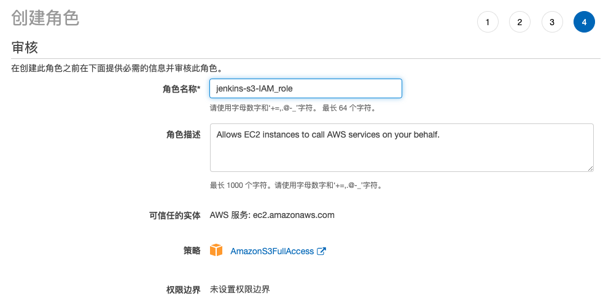

**将IAM角色附加到jenkins实例中**

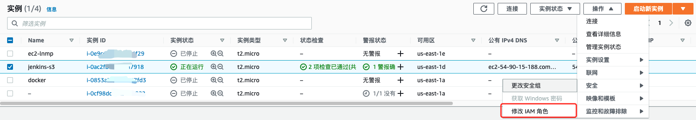

---

## 2.3、Jenkins安装S3 publisher插件

在系统管理->插件管理，选择安装S3 publisher。

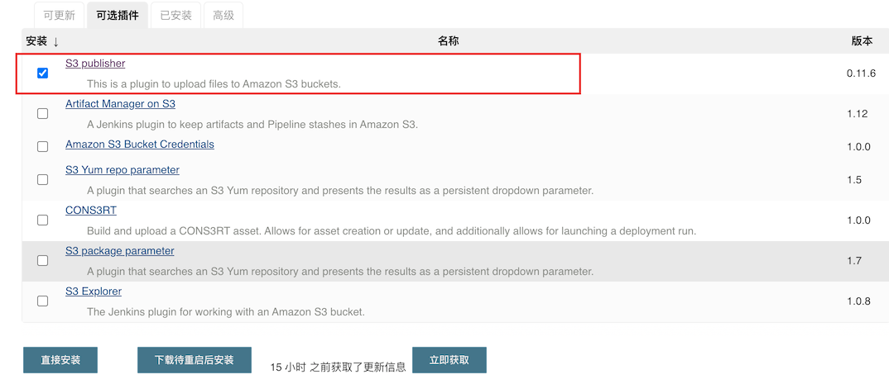

**插件安装完成之后，则前去配置S3 publisher。**

## 2.4、配置S3 publisher

在系统管理->系统配置，下拉至最下方，`Amazon S3配置文件`中进行配置

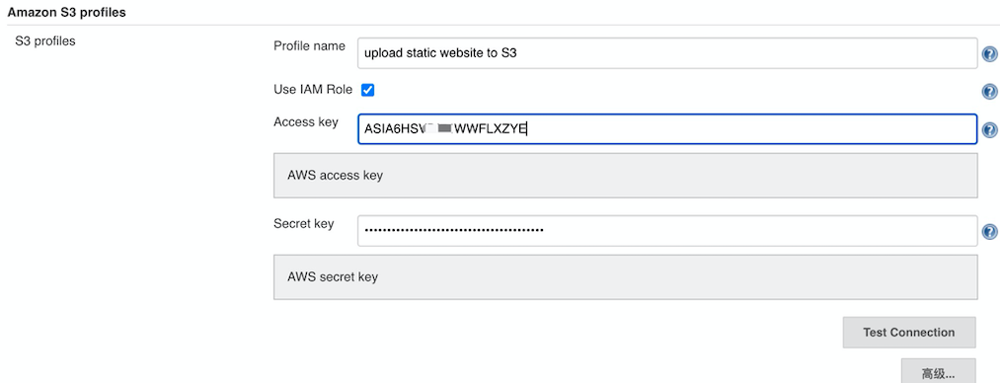

- **Profile name：**配置名字
- **Use IAM Role：**勾选IAM角色
- Access key：access key
- **Secret key：**access secret key

**根据自己账号内容进行配置。**

---

## 2.5、创建任务

**创建一个“自由”风格的project**

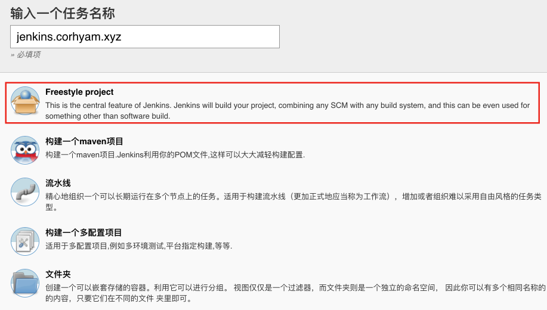

## 2.6、配置Repositry URL

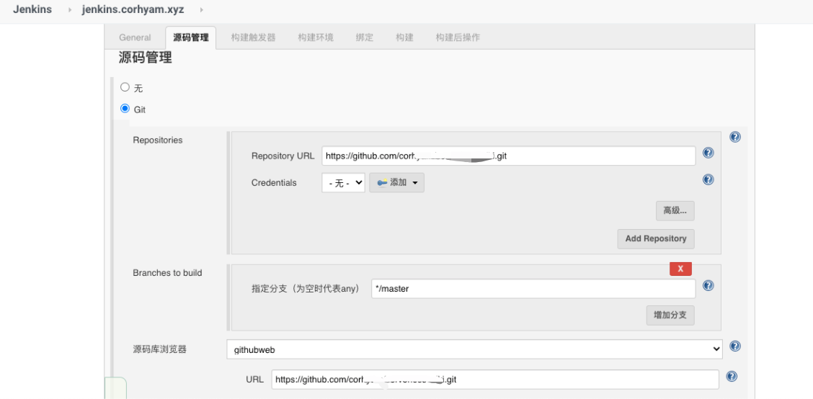

>根据自己的需求进行配置。

## 2.7、配置触发器

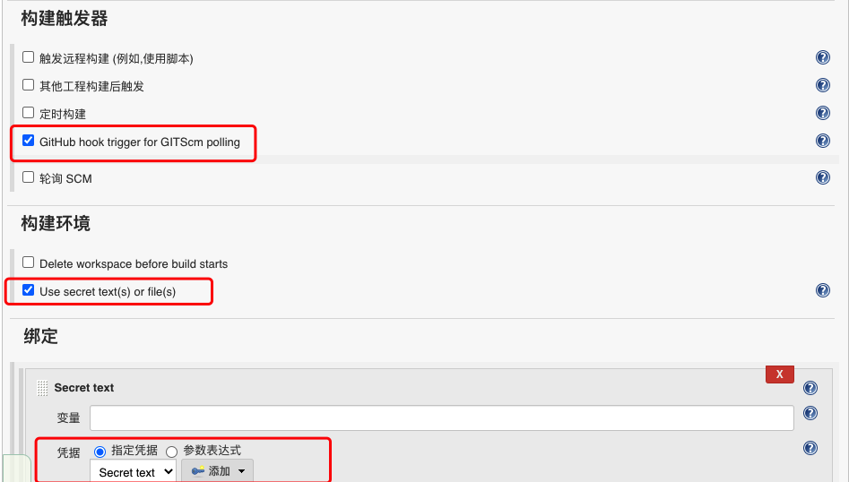

> GitHub Webhook触发jenkins进行构建，需要去Github上进行配置。也可以选择定时构建或者轮询，定时去扫描代码有没有更新，和Crontab差不多。
>
> `Sercret text`为Github中的`Personal access tokens`，需要前往Github创建，并在jenkins中配置凭证。

## 2.8、构建后操作

**S3 publisher配置**


> 此处根据自己想要上传的情况进行配置，此处本人的docsify文档在`client/dist/`文件夹内，所以资源处配置为`client/dist/**`，
>
> 目标存储桶填写您需要上传的存储桶。填写完毕之后进行保存。

## 2.9、构建测试

在Jenkins中点击立即构建进行测试，查看构建是否成功。

> 以下截取部分构建后控制台输出。
>
> 当看到`Finished：success`时则构建成功

```shell
Publish artifacts to S3 Bucket bucket=jenkins1.corh, file=scene.md region=us-east-1, will be uploaded from slave=false managed=false , server encryption false
Publish artifacts to S3 Bucket bucket=jenkins1.corh, file=serverless-deploy.md region=us-east-1, will be uploaded from slave=false managed=false , server encryption false
Publish artifacts to S3 Bucket bucket=jenkins1.corh, file=serverless-install.md region=us-east-1, will be uploaded from slave=false managed=false , server encryption false
Publish artifacts to S3 Bucket bucket=jenkins1.corh, file=what-is-Auth0.md region=us-east-1, will be uploaded from slave=false managed=false , server encryption false
Publish artifacts to S3 Bucket bucket=jenkins1.corh, file=what-is-docsify.md region=us-east-1, will be uploaded from slave=false managed=false , server encryption false
Publish artifacts to S3 Bucket bucket=jenkins1.corh, file=what-is-serverless.md region=us-east-1, will be uploaded from slave=false managed=false , server encryption false
Publish artifacts to S3 Bucket bucket=jenkins1.corh, file=why-i-choose-it.md region=us-east-1, will be uploaded from slave=false managed=false , server encryption false
Publish artifacts to S3 Bucket bucket=jenkins1.corh, file=zmark.md region=us-east-1, will be uploaded from slave=false managed=false , server encryption false
Finished: SUCCESS
```


前往S3中查看文件是否上传至存储桶，若正常则证明上传成功。

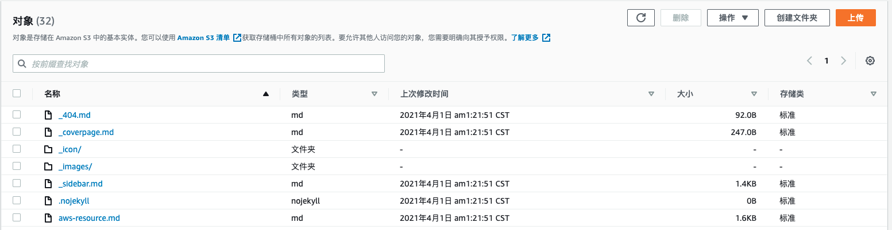


---


## 三、Github配置

## 3.1、配置github-webhook

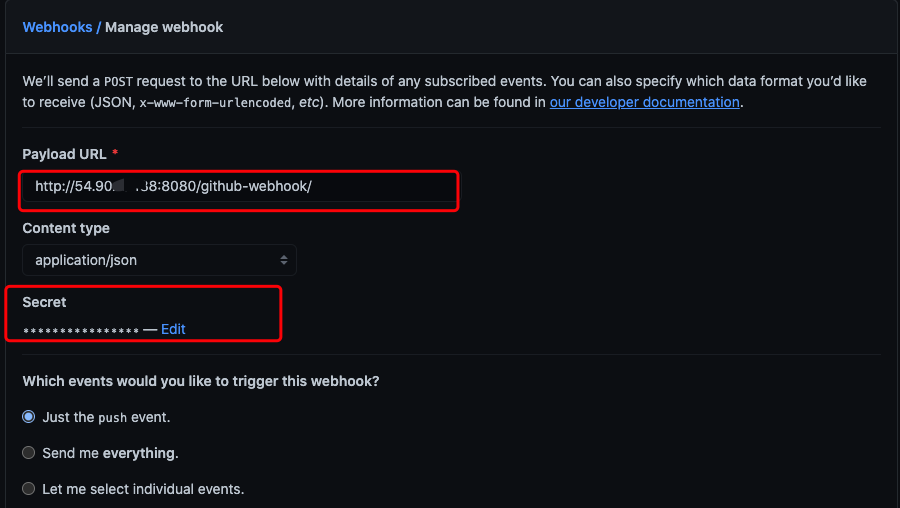

**此图片为github-webhook配置**

>**Payload URL：**`http://(jenkins服务器IP):8080/github-webhook/ `
>
>端口主要看自己配置的端口，此处本人使用docker映射了`8080`端口
>
>

>**Secret：**Github的个人访问令牌(Personal access tokens)。
>
>**需要先去开发人员设置中创建，再把它添加到此处，jenkins处Secret text同样配置该访问令牌**

---

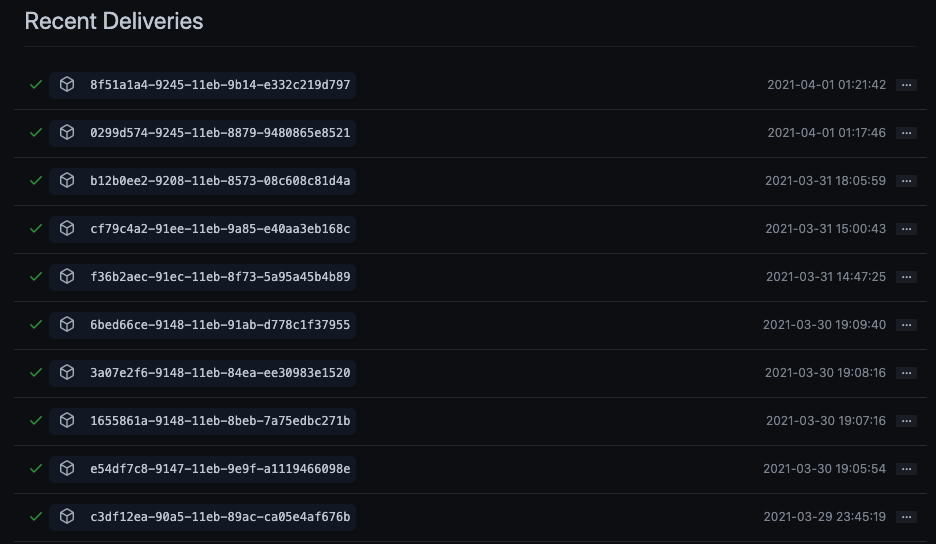

以上为最近的一些交付记录，Jenkins接受github发出的`POST`请求后，就会触发构建。

---

!> 如部署期间遇到问题可留言。转载请标明出处。

> **如有错误之处，还请予指正。**

---


**2021.4.1**

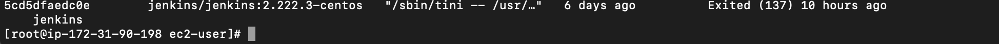

今天日常push代码到github，忽然发现没有自动部署，Jenkins管理页面也无法访问。本以为是服务器给宕了(因为我用的1核1g....)。

到AWS控制台后发现服务器正常运行，通过ssh进入服务器之后，`docker ps -a`查看到jenkins容器停掉了`Exited(137)`，上网查了一下貌似挺多出现这种问题都是内存分配问题，可能是OOM引起。

此处分配了update了一下内存，重新`docker start`了一下该容器继续使用。

