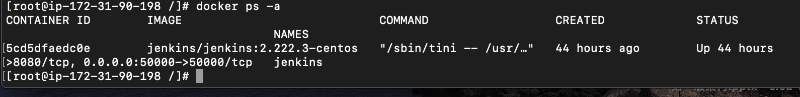
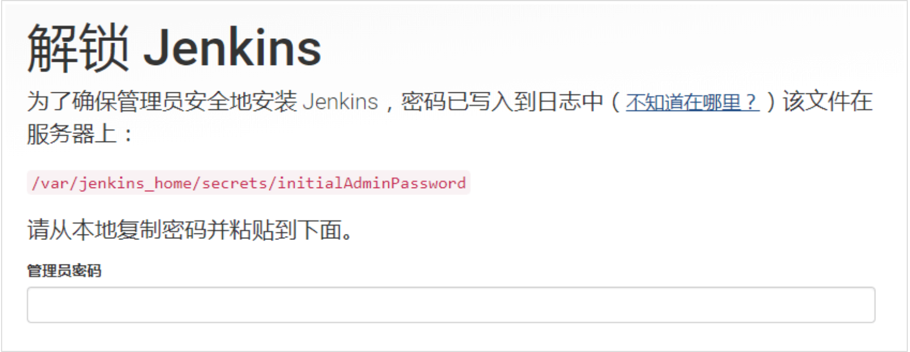
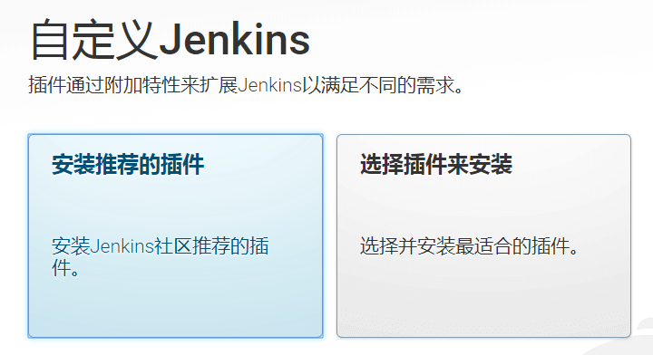
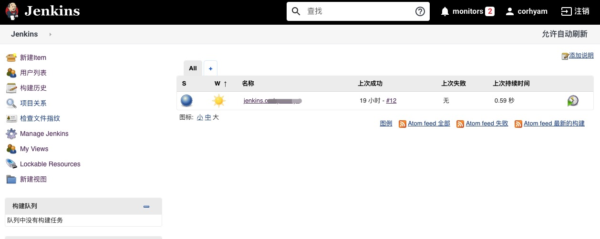

## 安装环境
>Docker 19.03.13-ce

>CentOS 7.6

由于该EC2服务器在us-east-1,所以不需要配置国内的docker-ce软件源
直接使用命令
```shell
yum install -y docker
service docker start 
```
还可以使用国内`Daocloud`的一键安装脚本。

如果是云服务器，当前AWS以及阿里云自研的linux镜像应该没包含在该脚本中，所以使用该脚本需要是Centos，Ubuntu一类的传统的操作系统。
```shell
curl -sSL https://get.daocloud.io/docker | sh
```
## 拉取Jenkins镜像
此处版本是2.222.3,可以根据自己需求做修改
```shell script
docker pull jenkins/jenkins:2.222.3-centos
```

## 创建本地数据卷
此处我做映射的路径为`/data/jenkins_home`,也可以自定义放到别的地方也行
```shell script
mkdir -p /data/jenkins_home/
```
需要修改目录权限，因为映射本地数据卷时，/data/jenkins_home/目录的拥有者为root，而容器中Jenkins用户的uid为1000。
```shell script
chown -R 1000:1000 /data/jenkins_home/
```

## 创建容器
```shell script
docker run -d --name jenkins -p 8080:8080 -p 50000:50000 -v /data/jenkins_home:/var/jenkins_home jenkins/jenkins:2.222.3-centos
```
-d 标识是让 docker 容器在后台运行
--name 容器的名字
-p 8080:8080 端口映射
-p 50000:50000 端口映射 JNLP jenkins代理程序
-v /data/jenkins_home:/var/jenkins_home 挂载数据卷，/data/jenkins_home是本地创建的数据卷


##配置Jenkins
使用浏览器访问`http://(your-domail):8080/` your-domail指你的ip或者是域名。  

#输入初始管理员密码

此处要求输入初始的管理员密码，需要你去获取，图片的路径为容器中的路径，你可以通过docker命令获取也可以本地cat你挂载的存储卷去获取
```shell script
docker exec jenkins cat /var/jenkins_home/secrets/initialAdminPassword
or
cat /data/jenkins_home/secrets/initialAdminPassword
```

进入后根据提示安装插件


创建管理员用户后，配置好对应的jenkinsURL配置即完成
